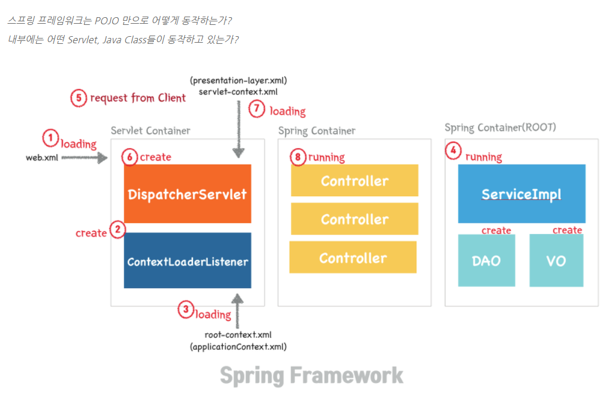
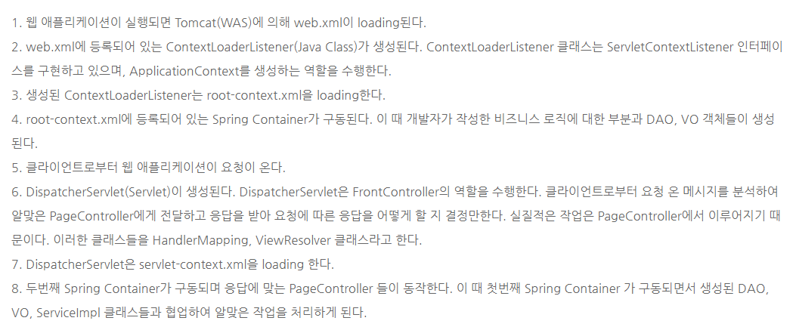

# 스프링 프레임워크의 구성요소 & 동작원리

> **POJO**(Plain Old Java Object) = 옛날 자바 객체
>
> 과거에는 자바로 웹 어플리케이션을 설계하기 위해서 servlet 클래스를 상속받아 구현을 함.  이는 POJO가 아님. 
>
> 개발자가 servlet 클래스를 직접 작성하지 않고 POJO만으로 웹 애플리케이션을 구축할 수 있게 하는 것이 스프링의 특징임.

---

### 스프링 컨테이너 종류

- 스프링 컨테이너에는 두가지 종류의 컨테이너가 있음.
  
- **BeanFactory**와 이를 상속한 **ApplicationContext**.
  
- BeanFactory는 스프링 설정 파일인 applicationContext.xml에 등록된 <bean> 객체를 생성/관리하는 기본적인 기능만 제공.

  컨테이너가 구동될 때 객체를 생성하지 않음. 오직 클라이언트의 요청에 의해서만 객체를 생성함. (lazy loading)

- ApplicationContext는 BeanFactory의 확장버전임.

  BeanFactory 기능 + 트랜잭션 관리, 메시지 기반의 다국어 처리 등 다양한 기능을 지원함.

  컨테이너가 구동될 대 <bean>에 등록되어 있는 클래스들을 객체화하는 즉시 로딩 방식으로 동작함.

  대표적으로 ApplicationContext를 구현한 클래스가 GenericXmlApplicationContext임.

- 즉, 스프링 컨테이너는 <bean> 저장소에 해당하는 XML 설정 파일을 참조하여 <bean>의 생명주기를 관리하고 여러가지 서비스를 제공함.

---

### IoC/DI (Inversion of Control / Dependency Injection)

> **제어의 역전 / 의존성 주입**

- 제어의 역행을 통해 애플리케이션을 구성하는 객체 간의 **느슨한 결합(낮은 결합도)**을 유지함. IoC는 객체 생성을 자바코드를 대신해서 컨테이너가 직접 처리함. 객체와 객체 사이의 의존관계 역시 컨테이너가 처리함.

---

### 의존성 주입(DI)이란?

> **의존성 관계 = 객체와 객체의 결합관계**

- 하나의 객체에서 다른 객체의 변수나 메소드를 사용하려면, 해당 객체에 대한 객체 생성과 생성된 객체의 레퍼런스 정보가 필요함.

  즉, 의존성이란 new이다. A라는 객체 생성자에서 new B();를 했다면, A는 B에 의존하게 됨. 주입이란 외부에서라는 뜻을 내포하고 있음.

  즉, A라는 객체에서 B를 생성하는 것이 아닌, 외부에서 B객체를 생성하고 A에 주입함으로써 의존 관계를 "없앨 수 있다". 이것이 의존성 주입이다.

#### 의존성 주입의 방법:

1. **XML을 이용한 의존성 주입**

   1-1) **생성자를 통한 의존성 주입**

   생성자에 인자를 주입하고자 하는 객체를 넣어준다. 스프링 설정 파일에서는 <constructor-arg>태그와 ref속성을 이용.

   1-2) **속성을 통한 의존성 주입**

   내부적으로 set method 이용. 스프링 설정 파일에서는 <property>태그를 사용, name 속성값이 호출하고자 하는 메소드의 이름이어야 함. name에 변수명을 적어주면 스프링에서 name의 첫 글자를 대문자로 바꾸고 앞에 set키워드를 붙여 set method를 실행.

2. **어노테이션을 이용한 의존성 주입**

   스프링에서는 **@Autowired**라는 어노테이션을 통해 의존성을 주입. @Autowired는 속성의 설정자 메소드에 해당하는 역할을 자동으로 수행.

   이와 비슷한 역할을 수행하는 자바 어노테이션으로는 **@Resource** 어노테이션이 있음.

   두 어노테이션의 차이는 bean을 탐색할 때 **우선순위로 하는 기준이 어떤 것이냐**임.

---

### AOP (Aspect oriented Programming)

> 직역으로 "**관점 지향 프로그래밍**"

> DI는 **의존성 주입**. AOP는 **로직 주입**.

- 코드를 작성할 때 모듈들에 공통적으로 존재하는 부분을 "**횡단 관심사**"라고 함.

- 모듈들의 각각 고유한 로직을 "**핵심 관심사**"라 함.

  즉, 각 모듈을 구성하고 있는 코드는 핵심관심사와 횡단관심사가 "**합쳐진 것**".

- AOP는 모듈마다 **중복되는 부분을 분리**하는 것이 주 목적임.

- AOP의 핵심 개념이 "**관심 분리(Seperation of Concerns)**"이다. 

  관점 지향 프로그래밍은 비지니스 메소드를 개발할 때, 핵심 비지니스 로직과 각 비지니스 메소드마다 반복 등장하는 공통 로직을 제거함으로써 **응집도가 높게** 개발할 수 있다.

1. **XML을 이용한 AOP**
2. **어노테이션을 이용한 AOP**
   - @Aspect 어노테이션은 클래스를 AOP에서 사용하겠다는 의미
   - @Befor 어노테이션은 대상 메소드를 실행 전에 이 메소드를 실행하겠다는 의미.

---

### PSA (Portable Service Abstraction)

> 직역: **일관성 있는 서비스 추상화**

- JDBC처럼 어댑터 패턴을 적용하여 같은 일을 하는 다수의 기술을 공통의 인터페이스로 제어할 수 있게 한 것을 서비스 추상화라고 함.

- 스프링에서도 서비스 추상화를 위해 다양한 어댑터를 제공.
  - OXM, ORM, 캐시, 트랜잭션 등 다양한 기술에 대한 PSA, 즉 API 제공.

---

---

----

# 출처:

> https://asfirstalways.tistory.com/ 

자세한 설명 감사합니다! : ] 