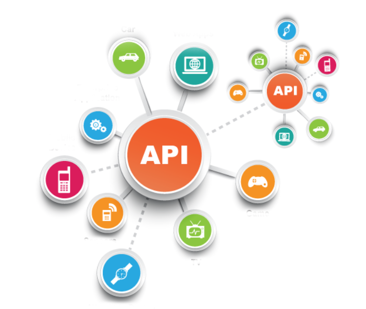

## API (Application Programming Interface)

>  Interface => 물건을 조작하기 위한 디자인을 뜻한다.

>  Programming interface <==> Human interface 쉽게 반대 개념으로 생각하자.

- Human interface
  - 마우스, 키보드, 터치스크린 등

- API

  - 한 프로그램이 다른 프로그램을 이용할 때 사용하는 도구, 기계가 이해하기 쉽게 입출력 데이터로 이루어져 있다.
  - "API는 사람을 위한 인터페이스가 아니라 프로그램을 위한 인터페이스다"
    - 즉, Application의 Programming을 위한 Interface다.

- Ex)

  1. 다운로드 받은 게임에서 페이스북 계정에 업적 달성 글을 남긴다.
     - 게임이 페이스북 API를 사용해 글 작성 요청

  2. 카톡으로 게임 친구추가 요청을 한다.
     - 게임이 카카오톡 API를 사용해 친구추가 메시지를 보낼 것을 요청

