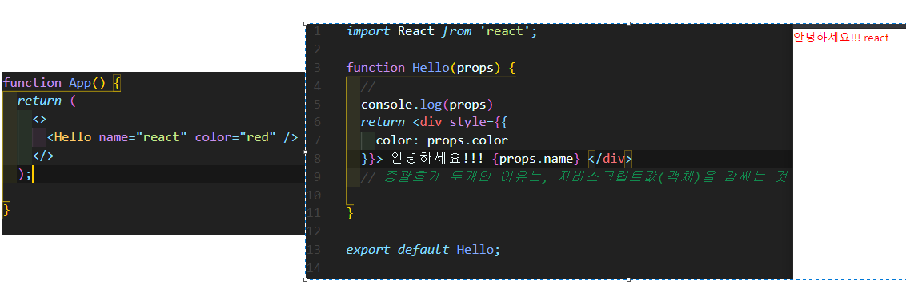
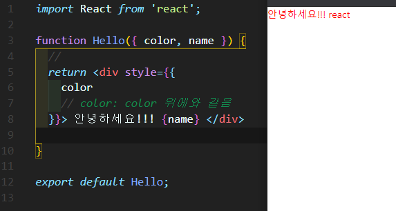
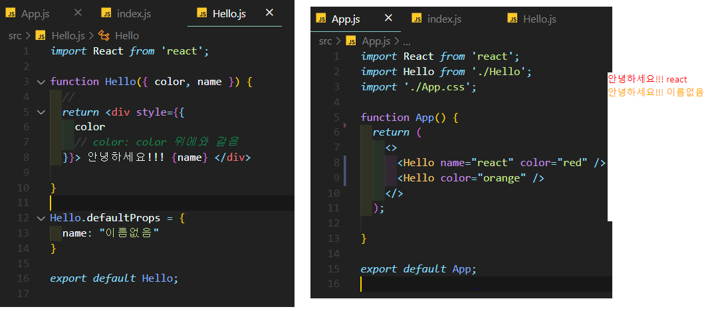
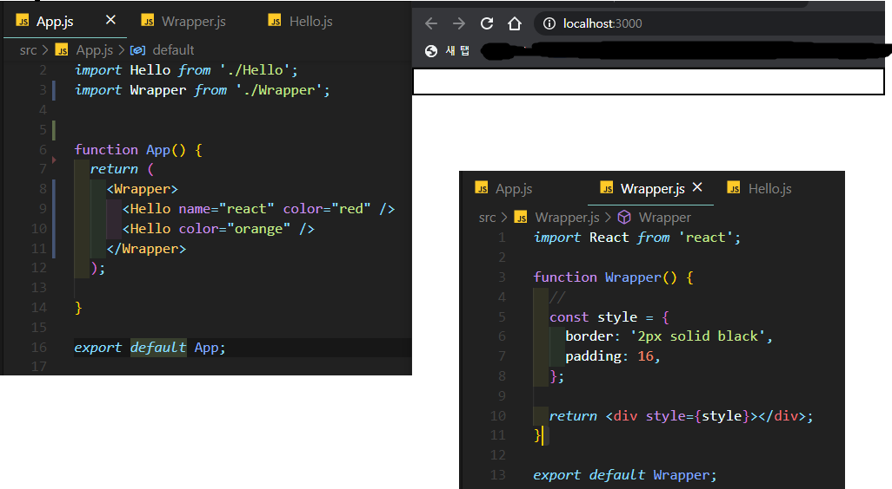
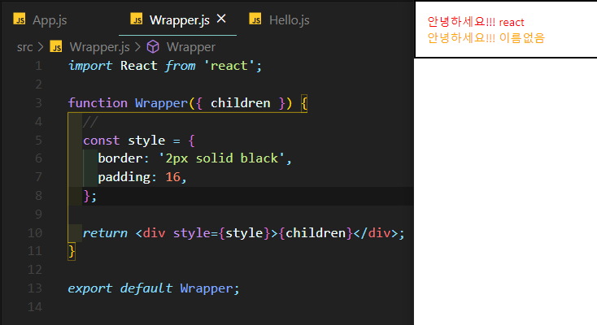

# Props를 통해 컴포넌트에게 값 전달하기

> 컴포넌트에 특정값을 전달하고 싶을 때 사용

- 이런식으로 사용이 가능하지만, 매번 "props.속성" 을 계속 사용할 수는 없다.

- 그래서 비구조할당, 구조분해를 사용해서 다르게 사용할 수 있다.

---

## defaultProps : 기본적으로 사용할 값

- 특정 값을 빠뜨렸을 때, 기본적으로 사용할 값을 정해줄 수도 있다.

---

## props.children

- Hello컴포넌트를 두개를 렌더링하고 있지만, 브라우저에서 보이지 않는다.

- 만약 브라우저에서 내용을 컴포넌트 내부에서 보여주고 싶다면, props.children을 사용하면 된다.

  

