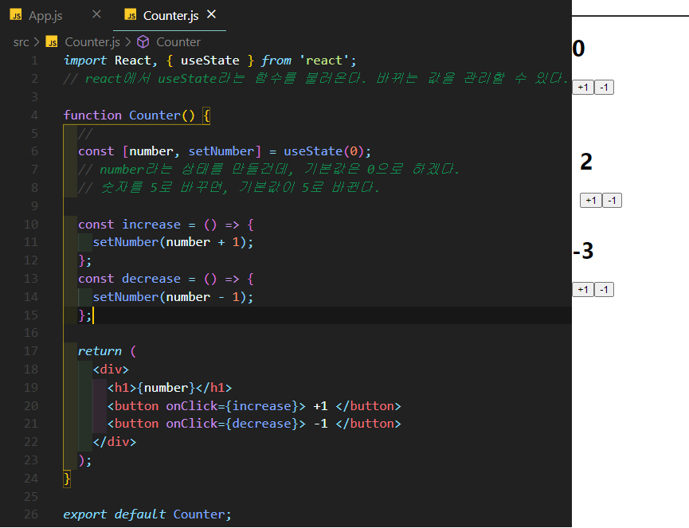
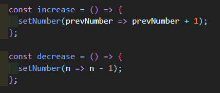

# useState를 통한 동적 상태 관리

> React의 Hooks중 하나

- useState(0)의 숫자를 5로 바꾸면, 기본값이 5로 바뀐다.

## useState를 활용한 함수형 업데이트

- 이런식으로 이 값을 어떻게 업데이트 할 것이다라는 로직이 있는 함수를 넣어줄 수 있다.
- 이후에 최적화하는 단계에서 함수형 업데이트가 필요하다.
- 나중에 성능 최적화에 대해서 배울 때 더 자세히 알아보자.

