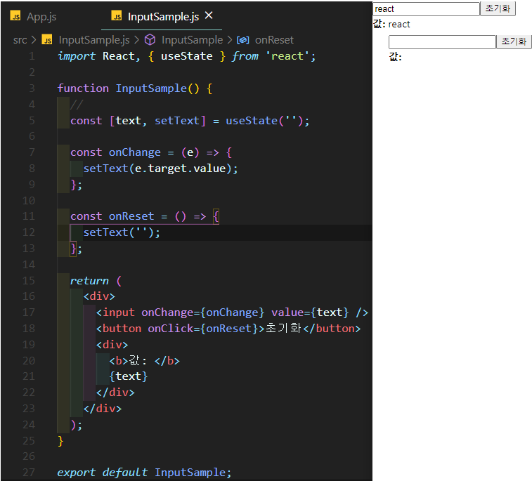
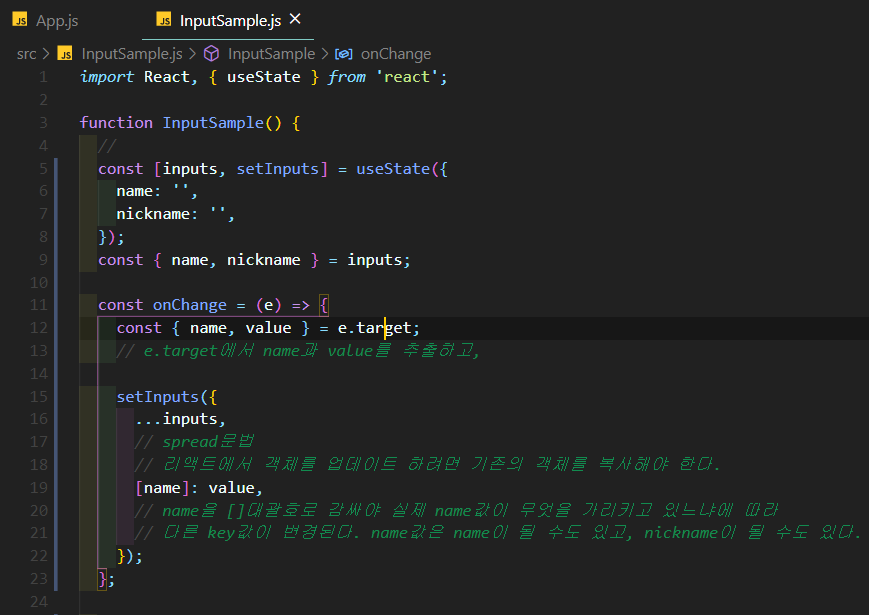
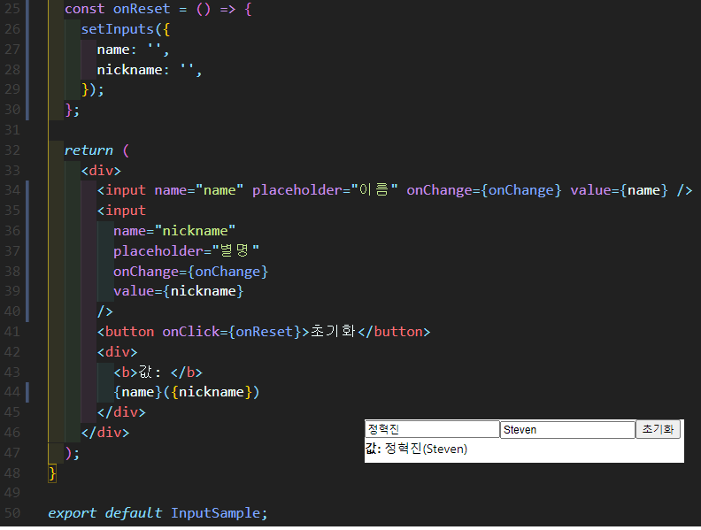

# 리액트에서 input 상태 관리하기

---

# 여러개의 input 상태 관리하기

- 단순히 useState를 여러개 사용하는 방법은 좋은 방법이 아니다.
- input에 값을 설정하고, 이벤트가 발생했을 때 그 값을 참조하는 방법으로 만드는 것이 좋다.
- 기존에 input을 하나 사용할 때는 문자열 값을 관리했지만, 여러개를 사용할 때는 여러개의 문자열을 가지고 있는 객체 형태의 상태를 관리해줘야 한다.

-  객체 상태를 업데이트 할 때는, 꼭 기존의 상태를 복사하고, 특정값을 덮어 씌우고, 그것을 새로운 상태로 설정해줘야 한다.
  - 이를 "불변성을 지킨다"라고 한다.
  - 불변성을 지켜줘야 상태가 업데이트 됐음을 강제할 수 있고, 이에 따른 필요한 렌더링이 발생하게 된다.
    - 그래서, 객체 상태를 업데이트 할 때는, spread문법을 사용하여 상태를 복사하고 나서, 특정값을 덮어 씌워 업데이트 해줘야 한다.
    - 불변성을 지켜줘야만, component 업데이트 성능을 최적화 할 수 있다.