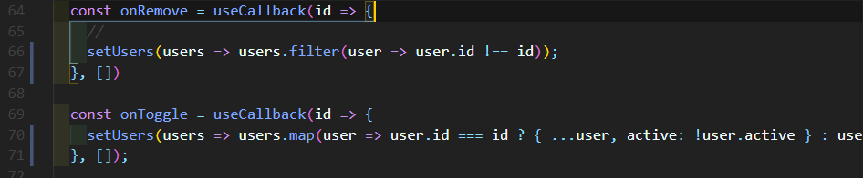
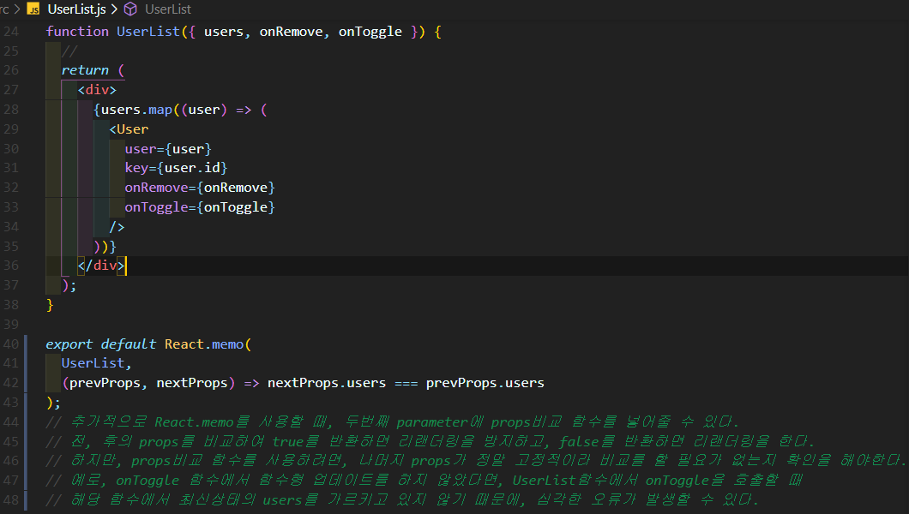

## React.memo

> 컴포넌트에서 리랜더링이 불필요할 때 이전에 랜더링 했던 결과를 재사용 할 수 있게 하는 방법을 알아보자.
>
> 컴포넌트의 리랜더링 성능을 최적화 할 수 있다!

- 방법은 굉장히 쉽다.

```js
export default React.memo(UserList);
```

- 컴포넌트를 내보낼 때 React.memo()로 감싸주면 된다.
- React.memo()를 사용하면 props가 바뀌었을 때만 리랜더링을 한다. 최적화 끝!

- 하지만, 필요한 작업이 몇가지 더 있다. 아래 코드와 방법을 확인해보자.

 ```js
// App.js

import React, { useRef, useState, useMemo, useCallback } from 'react';
import CreateUser from './CreateUser';
import UserList from './UserList';

function countActiveUsers(users) {
  //
  console.log('활성 사용자 수를 세는중...')
  return users.filter(user => user.active).length;
}

function App() {
  //
  const [inputs, setInputs] = useState({
    username: '',
    email: '',
  });
  const { username, email } = inputs;
  const onChange = useCallback(e => {
    const { name, value } = e.target;
    setInputs({
      ...inputs,
      [name]: value
    });
  }, [inputs]);

  const [users, setUsers] = useState([
    {
      id: 1,
      username: 'HJ',
      email: 'hyukjin4976@naver.com',
      active: true,
    },
    {
      id: 2,
      username: 'Steve',
      email: 'stevej0717@gmail.com',
      active: false,
    },
    {
      id: 3,
      username: 'HyukJin',
      email: 'wjdgurwls3784@hanmail.com',
      active: false,
    },
  ]);

  const nextId = useRef(4);

  const onCreate = useCallback(() => {
    const user = {
      id: nextId.current,
      username,
      email,
    };

    setUsers(users.concat(user))
    setInputs({
      username: '',
      email: ''
    })
    nextId.current += 1;
  }, [username, email, users]);

  const onRemove = useCallback(id => {
    //
    setUsers(users.filter(user => user.id !== id));
  }, [users])

  const onToggle = useCallback(id => {
    setUsers(users.map(user => user.id === id ? { ...user, active: !user.active } : user));
  }, [users]);

  const count = useMemo(() => countActiveUsers(users), [users]);

  return (
    <>
      <CreateUser
        username={username}
        email={email}
        onChange={onChange}
        onCreate={onCreate} />
      <UserList users={users} onRemove={onRemove} onToggle={onToggle} />
      <div>활성 사용자 수: {count} </div>
    </>

  );
}

export default App;

 ```

```js
// UserList.js

import React from 'react';

const User = React.memo(function User({ user, onRemove, onToggle }) {
  const { username, email, id, active } = user;

  return (
    <div>
      <b
        style={{
          color: active ? 'green' : 'black',
          cursor: 'pointer',
        }}
        onClick={() => onToggle(id)}
      >
        {username}
      </b>
      &nbsp;
      <span>({email})</span>
      <button onClick={() => onRemove(id)}>삭제</button>
    </div>
  );
});

function UserList({ users, onRemove, onToggle }) {
  //
  return (
    <div>
      {users.map((user) => (
        <User
          user={user}
          key={user.id}
          onRemove={onRemove}
          onToggle={onToggle}
        />
      ))}
    </div>
  );
}

export default React.memo(UserList);

```

- App.js파일에서 UserList 컴포넌트에는 onRemove와 onToggle을 전달한다.
- UserList.js파일에서 User컴포넌트랑 UserList에 React.memo를 넣어줘서, 만약 props가 바뀌지 않았다면 리랜더링을 방지하도록 설정했다.
- 하지만, App.js파일에서 onRemove 와 onToggle을 보면 users가 deps에 있다. 즉, users배열이 바뀌면 이 둘도 바뀌고 UserList는 이 둘이 바뀌었으니 내부에 있는 것들을 리랜더링 할 것이고, UserList.js파일에서 User도 이 둘이 바뀌었으니 리랜더링을 할 것이다.
  - 이 문제를 해결하려면, onToggle, onRemove, onCreate 등의 함수들에서 기존 users를 참조하면 안된다.
  - 그렇기 때문에, useState의 함수형 업데이트를 해줘야 한다.


- 아래는 onCreate()함수의 일부다.


- 함수형 업데이트를 하면 deps에 users를 안넣어도 된다.

- setUsers에 등록한 콜백함수의 parameter에서 최신 users를 조회하기 때문에 굳이 deps에 users를 넣지 않아도 된다.
- 결국, onCreate()함수는 username과 email이 바뀔 때에만 새로 만들어진다.



- 이런식으로 다 바꿔주면 된다.

- 아래는 props비교 함수를 사용하는 방법이다.



- 성능 최적화는 모든 곳에 사용한다고 좋은게 아니다. 필요한 곳만 사용하자!!!