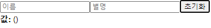
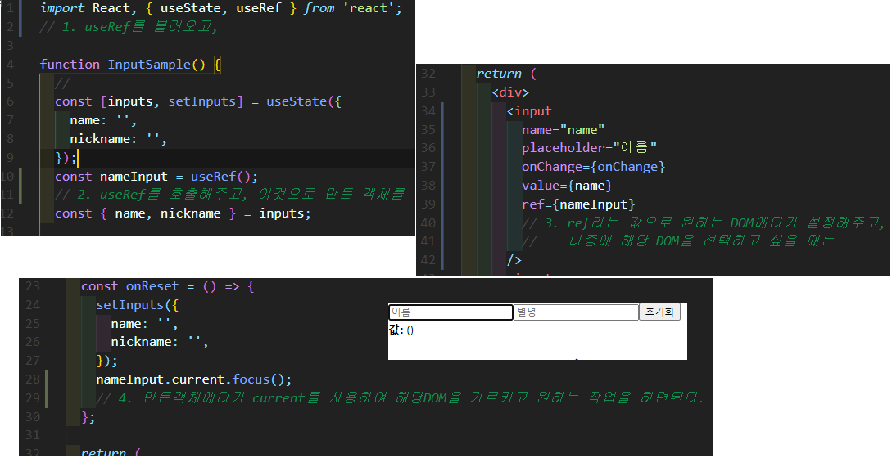

# useRef로 특정 DOM 선택하기

> HTML과 JS를 사용할 때 특정 DOM을 선택해야 하는 상황에 getElementById() or querySelector()와 같은 DOM selector를 사용한다

> React 프로젝트에서도 가끔식 DOM을 선택해야 하는 상황이 발생한다
>
> > 특정 element의 크기나 위치를 가져오거나, focus를 설정해줘야 한다던지 등...
> >
> > > 이럴때 React에서는 ref를 사용한다. 
> >
> > > 함수형 컴포넌트에서 사용할 때는 useRef라는 훅함수를 사용한다.
> >
> > > 클래스형 컴포넌트에서는 React.createRef()를 사용한다. 또는 콜백함수로도 사용 가능하다.

---

### 우선 함수형 컴포넌트에서 사용하는 useRef에 대해서 알아보자.

- 초기화 버튼을 누르면 포커스가 초기화 버튼에 가있는 것을 볼 수 있다.

- focus() 설정 후 초기화 버튼을 누르면 포커스가 바뀐 것을 확인할 수 있다.

