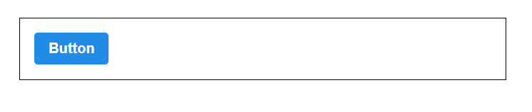

## Syntactically awesome stylesheets

- CSS 프리프로세서, 복잡한 작업을 쉽게 할 수 있게 해주고, style코드의 재사용성을 높여주고, 코드의 가독성도 높여줘서 유지보수에도 도움을 준다.

```bash
$ npx create-react-app styling-with-sass
```

```bash
$ cd styling-with-sass
$ yarn add node-sass
```

- 이 라이브러리는 scss를 css로 변환해주는 역할을 한다.


```js
// App.js

import React from 'react';
import Button from './components/Button';
import './App.scss';

function App() {
  return (
    <div className="App">
      <div className="buttons">
        <Button>Button</Button>
      </div>
    </div>
  );
}

export default App;
```

```scss
// App.scss

.App {
  width: 512px;
  margin: 0 auto;
  margin-top: 4rem;
  border: 1px solid black;
  padding: 1rem;
}
```


```js
// Button.js

import React from 'react';
import './Button.scss';

function Button({ children }) {
  return <button className="Button"> {children} </button>;
}

export default Button;
```

```scss
// Button.scss

// 변수를 사용할 때는 $표시를 사용 한다.
$blue: #228be6;

.Button {
  color: white;
  font-weight: bold;
  outline: none;
  border: none;
  border-radius: 4px;
  cursor: pointer;

  height: 2.25rem;
  // 현재 브라우저 페이지의 기본폰트 사이즈에 기반하여 사이즈가 조정된다.
  // 크롬은 기본 16px, 2.25rem이면 둘을 곱하면 36px이된다.
  padding-left: 1rem;
  padding-right: 1rem;
  font-size: 1rem;

  background: $blue;
  &:hover {
    background: lighten($blue, 10%);
  }
  &:active {
    background: darken($blue, 10%);
  }
}
```



