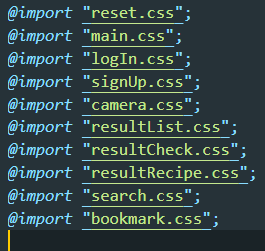
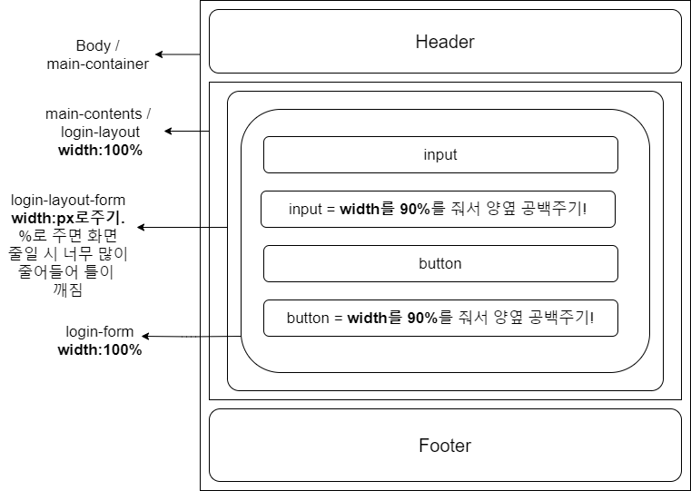
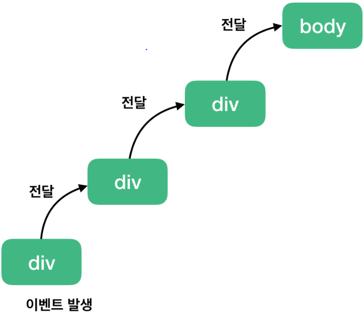

# Final Project 문서화

[TOC]

---


## 1. HTML

```html
<textarea cols="40" rows="30" readonly>
```

- cols와 rows 수를 정해주면, 화면에 보이는 text의 양을 지정(제한)할 수 있다.

- readonly : text의 추가, 수정 및 제거가 불가능하다. 오직 '읽기'만 가능해진다. 


```html
<input id="name" name="name" type="text" placeholder="이름을 입력해주세요." autocomplete="off" autofocus>
```

- autocomplete: 자동 완성기능 해제.
- autofocus: 자동으로 입력창에 커서가 이동. 하지만 작동하지 않는 경우도 있다. 그래서 주로 JS로 만들어 사용하는 편이다.


---


## 2. CSS

> 프로젝트를 수행하면서 HTML, CSS,  JS파일들을 한 파일에 같이 사용하지 않고, 분리하여 각각의 파일들로 만들어 사용하였다. 한 곳에 전부 구현하지 않고 분리하여 구현을 하면 코드의 유지보수가 훨씬 편리해진다.



- 위의 CSS코드는 styles.css라는 파일 상단에 사용한 코드이다. 위와 같이 사용하게 되면, 각각의 HTML파일에 해당  CSS파일을 링크하지 않고, 아래와 같이 코드 하나로 모든 CSS를 연결 할 수 있다.

```css
<link rel="stylesheet" href="styles.css">
```

- 위와같이 사용하는 이유는 유지보수의 용이함은 물론이고, 한 페이지에 여러 CSS를 링크해야하는 수고를 덜 수 있다. (@import 코드는 세미콜론(;)이 '필수'이다.)

- reset.css는 구글에서 검색하면 바로 나온다. 해당 css는 웹 브라우저의 기본 css속성(ex. margin)을 초기화 해 개발을 할 때 조금 더 수월하게 작업할 수 있다.


- 반응형 웹은 어렵고 복잡했다.

  width 속성의 %와 px을 골고루 사용해야 하며, margin 속성도 그러하다.

  max-width와 min-width도 골고루 사용하게 되면 웹 틀의 깨짐 현상을 없앨 수 있다.



- 반응형 설정은 "@media" (미디어쿼리)를 능숙하게 다루면 더욱 쉬워진다.

  ex)

  ```html
  <!-- HTML -->
  <div id="id"></div>
  ```

  ```css
  /* css */
  #id{
      margin-top:30px
  }
  
  @media (max-width: 1000px) {
    #id {
      margin-top: 10px;
    }
  }
  ```

- div는 margin-top이 30px인 속성을 갖지만, 미디어쿼리를 사용하여 웹 넓이가 1000px 이하로 줄어들면 margin-top을 10px로 변경할 수 있다.


---


## 3. JS

> 이 프로젝트에서는 어떠한 라이브러리도 사용하지 않고 순수 자바스크립트, 즉 Vanilla JS만을 사용하여 제작하였다. 
>
> 그 이유는, JS 라이브러리들은 무겁기 때문에 Vanilla JS로 코딩을 하면 웹 자체의 속도가 빨라질뿐만 아니라 


- HTML에서 JS를 구현할 시 사용되는 방법은 두가지가 있다.

1. ```html
   <!-- HTML -->
   <div id="HJ" onclick="fnc()"></div>
   ```

2. ```js
   //JS
   let HJ = document.getElementById("HJ");
   
   HJ.addEventListener("click", fnc(){your function here});
   // or
   HJ.addEventListener("click", fnc);
   
   function fnc(){
       your function here
   };
   //or
   const fnc = () => {
     your function here
   };
   ```

- 순수 HTML코드를 유지하고 유지보스를 용이하게 하기 위해 최근에는 주로 2번째 방법을 사용한다. 하지만 1번 방법은 '항상' 작동하지만, 2번 방법은 Internet Explorer 9 이전 버전에서는 작동하지 않는다. 


- 고정된 Header가 있는 HTML파일을 여러개 만들면, 모든 HTML에 Header를 넣어줘야 한다. 하지만, 이런식의 코딩은 Header부분의 코드 추가나 수정, 혹은 오류 발생시에 모든 HTML파일을 전부 손봐야 한다는 단점이 있다. 즉 유지보수가 굉장히 어렵다.
  - ex) header, sidenav 등등

- 그래서 반복되는 html 코드 부분을 js파일에 옮긴 후, 해당 코드가 필요한 HTML에서 아래코드로 불러와 사용하면 편리하다.

```html
<script src="/js/main.js"></script>
```


- JS로 autofocus 사용 방법. 

```html
<!--HTML-->
<input id="recipe__search" type="text">
```

```js
//JS
window.onload = function () {
  const recipeSearch = document.getElementById("recipe__search").focus();
}
```


```html
<!--HTML-->
<input type="text" placeholder="추가하실 재료를 입력해주세요!" onKeypress="javascript:if(event.keyCode==13) {addIng()}">
```

```js
//JS
function addIng(){
event.preventDefault()
your function here
}
```

- 입력창에서 엔터키를 클릭 시,  addIng()라는 함수를 실행하는 코드이다.
  - onKeypress: 키보드 자판 클릭시 실행
  - keyCode==13은 엔터키를 가리킨다.
  - event. 은 해당 태그안에서 일어나는 이벤트발생(드래그, 클릭, 타이핑 등등)을 말한다.

- 하지만, 입력창에서 엔터키 클릭 시 함수는 실행하고 기본값인 submit기능을 없애고 싶을 때, 함수 안에  event.preventDefault() 코드를 추가해주면 된다.


```js
//JS
const addBm = event.target;
    if (addBm.getAttribute("src") == "images/bm-logo.png") {
      addBm.setAttribute("src", "images/bm-logo-checked.png");
    } else if (addBm.getAttribute("src") == "images/bm-logo-checked.png") {
      addBm.setAttribute("src", "images/bm-logo.png");
    }
```

- 해당 코드는 이미지에서 addBm이라는 북마크를 클릭 시, 별의 색이 투명에서 노랑으로 바뀌는 코드이다.
  - 위 코드에서 보이듯, addBm.src 로 사용하지 않고, addBm.get(set)Attribute("src")로 사용하였다.
  - 그 이유는 addBm.src로 사용하게 되면, 웹 브라우저에서 해당 이미지의 attribute가 아닌 property를 가져온다. 여기서 문제는 property값은 동적으로 그 값이 변하기에 해당 이미지를 불러오지 못할 수도 있다. 때문에, 정적인 attribute를 사용해야 해당 이미지의 원래의 src 속성을 가져올 수 있다.
  - ex) 체크박스 태그가 있을 때 유저가 체크박스에 체크를 하면 attribute의 상태는 변하지 않지만 property의 상태는 checked로 변하게 됨.


- let frag = document.createDocumentFragment(); 는 가짜 document를 만드는 방법이다.

```js
//JS
for (i in recipeList){
    let frag = document.createDocumentFragment();
    let menuList = document.createElement("li");
    let aboutMenu = document.createElement("div");
	let recipeTitle = document.createElement("h1");

    menuList.appendChild(aboutMenu);
    aboutMenu.appendChild(recipeTitle);
    frag.appendChild(menuList);
    document.body.appendChild(frag);
}
```

- JS로 여러 document 태그를 반복문을 통해 조작하면 성능이 매우 떨어진다. 때문에, 가짜 document를 만들어 이곳에 생성한 태그들을 추가해준 후, 한번에 html에 추가한다. 이렇게 사용하면 실제 document는 한 번만  조작이 돼서 성능에 부담이 줄어든다.


- 이벤트 버블링과 이벤트 캡쳐링

  - 이벤트 버블링과 캡쳐링은 JS로 이벤트를 만들다보면 쉽게 만날 수 있는 상황이다. 
  - 아래는 이벤트 버블링의 시각화이다. (이벤트 캡쳐링은 반대방향인 위에서부터 아래다.)

  

  - 브라우저가 이벤트를 감지하는 방식 때문에 발생한다.

    브라우저는 특정 화면 요소에서 이벤트가 발생했을 때 그 이벤트를 최상위에 있는 화면 요소까지 이벤트를 전파한다.

```js
//JS
function addBookmark(event) {
  event.stopPropagation();
    your function here;
};
```

- event.stopPropagation(); 
  
  이 코드를 원하는 함수에 추가하면, 해당 함수의 버블링과 캡쳐링을 방지할 수 있다.
  
  - 이벤트 버블링의 경우에는 클릭한 요소의 이벤트만 발생시키고 상위 요소로 이벤트를 전달하는 것을 방해한다. 이벤트 캡쳐링의 경우에는 클릭한 요소의 최상위 요소의 이벤트만 동작시키고 하위 요소들로 이벤트를 전달하지 않는다.


---


## 4. 프로젝트 내 함수 코드리뷰 (스크롤 주의!)


#### 1. main.js

- 모든 html파일 body바로 아래부분에 `<script src="main.js"></script>`을 추가.

```js
mainHeader.innerHTML = `
      	// 헤더 좌측 햄버거 메뉴 아이콘을 클릭 시 나오는 사이드 네비바.
      <div id="mySidenav" class="sidenav">
		.......
	  </div>

		// 좌측 햄버거 메뉴 아이콘
      <div id="bg" onclick="closeNav()"></div>
      <div id="nav-container" onclick="openNav()">
      	.......
      </div>

		// 헤더 우측 기능 바로가기 메뉴 아이콘 및 이름
      <div class="nav__nav-column">
      	.......
   	  </div>`;
```

```js
//햄버거 메뉴바 열기 
function openNav() {
  document.querySelector(".sidenav").style.width = "250px";
  document.getElementById("bg").style.display = "block";
}

// 햄버거 메뉴바 닫기
function closeNav() {
  document.querySelector(".sidenav").style.width = "0";
  document.getElementById("bg").style.display = "none";
}

// css로 기본 width설정을 0으로 해두고 display설정도 none으로 해둔다.
// 두가지를 다 하는 이유는, width만 0을 주면 좌측에 text들이 전부 가려지지 않고 삐져나와 보인다.
// block만 none을 준다면, 열기 효과를 실행할 때, 좌측에서 밀려나오는 효과를 줄 수 없다.
// 좌측 자리에 바로 생겼다가 없어지는 효과만 줄 수 있음.
```

---


#### 2. login.js & signUp.js

- login.js에서 이메일 아이디와 비밀번호를 체크해주는 정규표현식은 구글에서 쉽게 찾을 수 있으니 설명을 생략한다.

```js
// 이용약관
const PolicyModalOpenButton = document.getElementById("policy-modal__open");
const PolicyModal = document.querySelector(".policy__modal");
const PolicyOverlay = PolicyModal.querySelector(".modal__overlay");
const PolicyModalCloseBtn = document.getElementById("policy-modal__close");
// 위는 HTML에서 만든 모달창의 id와 class값을 DOM으로 가져와 사용한다는 선언들.

// 아래는 ECMAScript 6부터 사용되는 방식의 함수다.
const PolicyOpenModal = () => {
  PolicyModal.classList.remove("hidden");
};

const PolicyCloseModal = () => {
  PolicyModal.classList.add("hidden");
};

PolicyModalOpenButton.addEventListener("click", PolicyOpenModal);
PolicyModalCloseBtn.addEventListener("click", PolicyCloseModal);
PolicyOverlay.addEventListener("click", PolicyCloseModal);
// 이벤트리스너를 통해 이용약관이라는 텍스트를 클릭 시 모달창이 열리고, 닫는 방법은 두가지이다.
// 닫기 버튼인 X를 클릭 시 모달창을 닫는다.
// 그리고 모달창을 제외한 뒤쪽 오버레이 배경 부분을 클릭해도 모달창이 닫힌다.
// (이 부분은 main.js의 sideNav바에도 적용했다.)
```

```css
.hidden {
  display: none;
}
/* css부분에서 hidden인 클래스의 display효과를 none으로 준다.
그리고, 모달창의 class에 hidden 효과를 넣어주면, 기본적으로 브라우저에서 모달창이 보이지 않는다. 
열기와 닫기 함수를 통해 모달창의 여러개 class중 하나인 hidden이라는 클래스를 제거, 추가하는 방식으로 구현했다.
*/
```

---


#### 3. search.js 

```js
// search.html이 열릴 시 input태그 검색창에 자동으로 커서 이동.
window.onload = function () {
  const input = document.getElementById("recipe__search").focus();
}

// 검색창에서 엔터키 클릭시 fnc()함수 실행.
function enterkey() {
  if (window.event.keyCode == 13) {
    fnc();
  }
}

// 검색창에서 값을 입력 시 location.href로 주소 이동을 하고,
// 백엔드에서 `/search/${recipeSearch.value}/1`; 을 통해 
// 결괏값인 데이터들을 이동한 주소에서 뿌려준다
function fnc() {
  const recipeSearch = document.getElementById('recipe__search');
  location.href = `/search/${recipeSearch.value}/1`;
}
```

---


#### 4. searchResult.js

```js
// searchResult.html에서 menu__lists라는 id를 가진 ul태그가 존재한다.
// 백엔드에서 데이터를 쏴주면 아래 for문을 통해 검색결과 데이터를 리스트로 만들어
// frag에 리스트들을 전부 넣어주고, 한번에 ul태그에 추가해 화면에 뿌려준다. 
const menuLists = document.getElementById("menu__lists");

for (i in recipeList) {
    // ul태그에 들어갈 각각의 메뉴 리스트.
  let menuList = document.createElement("li");
  menuList.className = "menu__list";
    
    // 각각의 메뉴 리스트에 들어갈 레시피 정보.
  let aboutMenu = document.createElement("div");
  aboutMenu.className = "about__menu";
    
    // 레시피 정보에 들어갈 레시피 이름.
  let recipeTitle = document.createElement("h1");
  recipeTitle.innerHTML = recipeList[i].title;
    
    // 레시피 정보에 들어갈 레시피 주재료.
  let recipeMain = document.createElement("span");
  recipeMain.id = "recipe-main-ingredients";
  recipeMain.innerHTML = `<span style="font-weight:bold";>ㅇ주재료:<br></span> ${recipeList[i].main.replace("[", "").replace("]", "")}`;
    
    // 레시피 정보에 들어갈 레시피 부재료.
  let recipeMinor = document.createElement("span");
  recipeMinor.id = "recipe-minor-ingredients";
  recipeMinor.innerHTML = `<span style="font-weight:bold";>ㅇ부재료:<br></span> ${recipeList[i].minor.replace("[", "").replace("]", "")}`;
    
    // 메뉴 리스트 안에서 우측에 들어갈 음식 이미지와 북마크 이미지의 전체 틀.
  let recipeImgContainer = document.createElement("div")
  recipeImgContainer.className = "recipe-img-container"
    
    // 음식 이미지의 틀.
  let recipeImgCover = document.createElement("div")
  recipeImgCover.className = "recipe-img-cover"

    // 음식 이미지.
  let recipeImg = document.createElement("img");
  recipeImgContainer.appendChild(recipeImgCover);
  recipeImgCover.appendChild(recipeImg)
  recipeImg.src = recipeList[i].img_complete;
  recipeImg.className = "menu__list-image";

    // 북마크 이미지 틀.
  let bmImgCover = document.createElement("div");
  bmImgCover.className = "bm-img-cover"
    
    // 북마크 이미지
  let bmImg = document.createElement("img");
  bmImgCover.appendChild(bmImg);
  bmImg.className = "bookmark-image"
    
    // 북마크 이미지인 안이 비어있는 별이, 클릭 시 안이 노란색으로 채워짐.
    // 정확히는 북마크 이미지가 바뀜.
  if (recipeList[i].bookmarkIsCheck == 0) {
    bmImg.src = "/images/bm-logo.png";
  } else {
    bmImg.src = "/images/bm-logo-checked.png";
  }
    //체크한 북마크의 해당 레시피의 고유 레시피 id를 가져와 북마크 모달창에 추가.
  bmImg.value = recipeList[i].id;
  bmImg.addEventListener("click", addBookmark);
  recipeImgContainer.appendChild(bmImgCover);

    //전체적으로 리스트에 레시피 정보들을 넣고, 리스트를 html의 ul태그에 넣어주는 작업.
  menuList.appendChild(aboutMenu);
  aboutMenu.appendChild(recipeTitle);
  aboutMenu.appendChild(recipeMain);
  aboutMenu.appendChild(recipeMinor);
  menuList.appendChild(recipeImgContainer);

  let frag = document.createDocumentFragment();
  frag.appendChild(menuList);
  menuLists.appendChild(frag);

    //리스트에서 메뉴 클릭시 레시피결과 페이지로 이동
  menuList.href = "/recipe" + "/" + bookmarkList[i]["id"].toString();
  menuList.addEventListener("click", function event() {
  	location.href = this.href;
  });
}
```

---


#### 5. bookmark.js

```js
const bookmarkOpenModal = () => {
  	// 왼쪽 네비바에서 북마크 클릭 시 네비바가 열려있는 상태에서 북마크 모달창까지 열려
    // 네비바와 모달창이 겹치고 오버레이 효과도 두개가 겹치는 현상이 발생한다.
    // 그래서 closeNav()를 통해 네비바에서만 북마크를 클릭 시 네비바와 해당 오버레이효과가
    // 꺼지도록 만들었다.
  closeNav();

    // 북마크 모달창은 html 파일이 없다. js로 html태그들을 생성하고 뿌려준다.
    // fetch가 '필수'이다.
    // 북마크 모달창이 열릴 시 보여지는 북마크한 레시피들의 목록과 오버레이 효과가 담겨질 전체 틀.
  let bookmarkContents = document.createElement("div");
  bookmarkContents.className = "bookmark__modal";

    // 북마크 모달창이 열릴 시 뒤에 생성되는 오버레이 효과와 오버레이 클릭 시 모달창이 닫히는 함수.
  let bookmarkCloseModalOverlay = document.createElement("div");
  bookmarkCloseModalOverlay.className = "modal__overlay";
  bookmarkCloseModalOverlay.setAttribute("onclick", "bookmarkCloseModal()");

    // 북마크 모달창이 열릴 시 메인 컨텐츠에 들어갈 레시피 목록 틀.
  let bookmarkContentLists = document.createElement("div");
  bookmarkContentLists.className = "bookmark-content-lists"

    // 레시피 목록 틀 안에서 레시피 리스트를 담을 ul.
  let bmc = document.createElement("ul");
  bmc.className = "bookmark-modal-content";

    // 북마크 모달창 닫기 버튼과 함수.
  let bookmarkCloseModal = document.createElement("button");
  bookmarkCloseModal.innerHTML = "X";
  bookmarkCloseModal.id = "bookmark-modal__close";
  bookmarkCloseModal.setAttribute("onclick", "bookmarkCloseModal()");

    // 만든 태그들과 데이터를 담은 틀을 북마크 모달창에 넣어주는 작업.
  bookmarkContents.appendChild(bookmarkCloseModalOverlay);
  bookmarkContents.appendChild(bookmarkContentLists);
  bookmarkContentLists.appendChild(bmc);
  bmc.appendChild(bookmarkCloseModal);

    // 여기서도 가상document를 활용하여 한번에 뿌려준다.
  let frag = document.createDocumentFragment();
  frag.appendChild(bookmarkContents)
  mainContents.appendChild(frag);


	// fetch를 사용하여 페이지 이동을 하지 않고, 해당 페이지에서 request와 response를 실행.
    // 북마크 기능을 모달창으로 만들어 모든 페이지에서 사용 가능하게 만든다.
  const odj = {
    // 권한 설정이 되어 있을때만 fetch실행
    // 즉, 로그인을 한 상태에서만 북마크 이용이 가능하다.
    credentials: "same-origin",
  };
  fetch("http://localhost:8080/loadBookmark", odj).then((res) => {
    // 정상 응답이 왔을 때 로직 실행
    if (res.status == 200) {
      res
        .json()
        .then((json) => printJsonList(json.recommandList));
    }
  });
}
```

---


#### 6. resultCheck.js

```js
// DOM. HTML주요 태그들 가져오기.
let resultForm = document.getElementById("result__form");
let closeBtn = document.getElementById("close__text-add");
const plusText = document.getElementById("plus__text");
let plusBtn = document.getElementById("info-plus-btn");
let resultInfo = document.getElementById("result__info");

// 아래 js로직들을 함수로 만들어둔 이유는, 메뉴 리스트를 만들어 뿌려주는 로직의 변수명들이
// bookmark.js, resultCheck.js, resultList.js, searchResult.js 등에서
// 중복이 되기 때문에 만들어 사용하였다...
// 사실상 재사용을 위해 겹치는 로직들을 함수로 만들어 사용하는게 맞다.
// 이 부분은 추후에 다시 리팩토링 할 예정이다.
resultCheckFunction();
function resultCheckFunction() {

  let frag = document.createDocumentFragment();
    
  //--start-- 재료 데이터 받는 곳//
  let analyzed__ingredients,
    i,
    ingredient__lists = "";

    
    // Thymeleaf를 통해 백에서 html로 데이털르 전달, html에서 js로 다시 데이터를 전달.
    // 데이터로 뷰를 만든 후 다시 html에 뿌려주는 방식이다.
    // 아래 for문과 함수들은 이전에 설명했으니 리뷰를 생략한다.
  analyzed__ingredients = {
    name: label
  };


  for (i in analyzed__ingredients.name) {
    let ingredientsTypes = document.createElement("div");
    ingredientsTypes.className = "ingredients-types";
    let ele = document.createElement("input");
    ele.readOnly = true;
    ele.className = "info";
    ele.setAttribute("type", "text");
    ele.setAttribute("name", "label");
    ele.setAttribute("value", analyzed__ingredients.name[i]);
    ingredientsTypes.appendChild(ele);

    let deleteBtn = document.createElement("button");
    deleteBtn.setAttribute("type", "button");
    deleteBtn.innerHTML = "X"
    deleteBtn.className = "info-delete-btn";
    deleteBtn.addEventListener("click", deleteLi);
    ingredientsTypes.appendChild(deleteBtn);

    frag.appendChild(ingredientsTypes);
    resultInfo.appendChild(frag);
    resultInfo.appendChild(plusBtn);
  }
```

---


#### 7. resultList.js

- 해당 파일 코드는 위에서 설명한 bookmark.js와 거의 겹친다. 때문에 코드리뷰는 생략한다.

---


#### 8. resultRecipe.js

```js
// 마지막인 선택한 레시피의 결과 화면이다.
// 해당 js파일에서는 레시피 목록에서 사용자가 클릭한 레시피의 모든 정보를 불러와
// 뷰로 만들어주는 작업을 한다.
// 그렇기에 for문을 사용하지 않고, DOM만 사용하여 하나씩 만들고, 가상document에 넣어
// 한번에 뿌려주는 로직을 만들었다.

resultRecipeFunction();
function resultRecipeFunction(){

    // 가상document 만들기.
    let frag = document.createDocumentFragment();
    
    // 최상단 조리 완료된 이미지를 담을 틀과 레시피에 들어갈 모든 정보를 담을 틀을 DOM으로 가져오기. 
    let resultRecipeInfo = document.getElementById("result-recipe-info");
    let recipeImg = document.createElement("img");
    recipeImg.id = "result-img";
    recipeImg.src = recipe.img_complete;
    
    // 레시피 명.
    let recipeHeader = document.createElement("header");
    recipeHeader.className = "recipeTitle";
    recipeHeader.innerHTML = recipe.title;
    
    // 레시피 설명
    let recipeDescription = document.createElement("p");
    recipeDescription.className = "recipeDescription";
    recipeDescription.innerHTML = `" ${recipe.description} "`;
    
    // servingInfo와 timeInfo는 숫자만 들어오기 때문에, 뒤에 text를 추가해 보기 편리하게 만들었다.
    let servingInfo = document.querySelector(".serving-info");
    servingInfo.innerHTML = `${recipe.size}인분`;
    let timeInfo = document.querySelector(".time-info");
    timeInfo.innerHTML = `${recipe.time}분`;
    let difficultyInfo = document.querySelector(".difficulty-info");
    difficultyInfo.innerHTML = recipe.level;
    
    // 받은 데이터를 전체 틀에 담는 과정.
    resultRecipeInfo.appendChild(recipeImg);
    resultRecipeInfo.appendChild(recipeHeader);
    resultRecipeInfo.appendChild(recipeDescription);
    
    // 주재료 정보
    // 데이터를 받아올 때 데이터에 [, ]와 같은 문자들이 포함되어 있었다.
    // 그래서 replace를 활용하여 빼주는 작업을 포함.
    let mainIngredientsInfo = document.querySelector(".main-ingredients-info");
    mainIngredientsInfo.innerHTML = `<span style="font-weight: bold">ㅇ주재료 :<br></span>
    ${recipe.main.replace("[", "").replace("]", "")}`;
    
    // 부재료 정보
    let minorIngredientInfo = document.querySelector(".minor-ingredients-info");
    minorIngredientInfo.innerHTML = `<span style="font-weight: bold">ㅇ부재료 :<br></span> 
    ${recipe.minor.replace("[", "").replace("]", "")}`;
    
    // 가짜document에 전부 담은 후, 한번에 뿌려주는 작업.
    frag.appendChild(recipeImg);
    frag.appendChild(recipeHeader);
    frag.appendChild(recipeDescription);
    resultRecipeInfo.appendChild(frag);
    
    // 레시피 조리 순서는 조금 다르게 진행했다.
    // 각각의 레시피마다 조리 순서가 다르기 때문에, for문을 사용하여 뿌려주는 작업을 진행했다.
    const recipeStepsInfo = document.getElementById("recipe-steps-info");
    
    // ''를 빼주는 작업.
    recipe__info = recipe.step.split("', '")
    recipe__img = recipe.img.split("', '")
    
    
    for (i in recipe__info) {
      recipe__info[i].replace("[", "").replace("]", "").replace("'", "");
      recipe__img[i].replace("[", "").replace("]", "").replace("'", "");
      recipeStepsInfo.id = "recipe-steps-info";
        
        // 전체적인 레시피 조리 순서를 담는 틀과 각각의 조리 순서를 담을 틀을 만드는 과정.
      let recipeSteps = document.createElement("div");
      recipeSteps.className = "recipe-steps";
      let step = document.createElement("span");
      step.className = "cook-Step";
      step.id = "cook-Step";
        
 	    // 데이터를 받아올떄 조리순서가 인덱스 0번부터 시작을 하여, 
        // 그대로 뿌려주면 조리순서가 0부터 시작한다.
  	    // 그래서 Number()로 숫자로 바꾼뒤, +1을 통해 조리순서를 1번부터 시작하게 만들었다.
      step.innerHTML = `<div id="step-Number" class="step-Number">${[Number(i) + 1]}.</div> ${
        recipe__info[i].replace("[","").replace("]","").replace("'","")
      }`;
        
        // 각 조리순서 사진에 대한 작업.
      let stepImg = document.createElement("img");
      stepImg.src = recipe__img[i].replace("[", "").replace("]", "").replace("'", "");
      
        // 전체 틀에 각각의 조리 순서와, 그 이미지를 담는다.
      recipeSteps.appendChild(step);
      recipeSteps.appendChild(stepImg);
    
        // 가상 document에 담아서 한번에 뿌려준다.
      frag.appendChild(recipeSteps);
      recipeStepsInfo.appendChild(frag);
    }
    
    	// 레시피 결과 화면 마지막에 표시할 조리 완료 text를 만들고 뿌려주는 작업.
    let stepsEnd = document.createElement("div");
    stepsEnd.id = "steps-end";
    stepsEnd.innerHTML = "- - - 끝 - - -";
    recipeStepsInfo.appendChild(stepsEnd);
}
```

---


