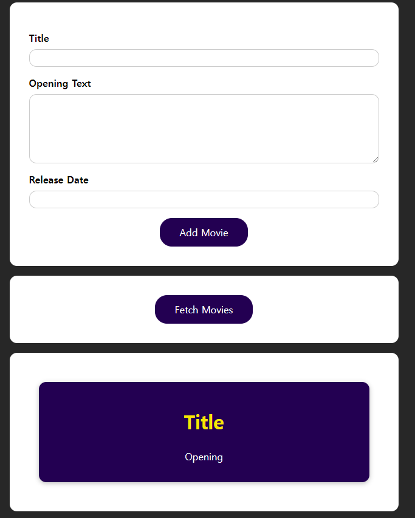

- 이미지

 <br>

```js
// src - App.js

import React, { useState, useEffect, useCallback } from 'react';

import MoviesList from './components/MoviesList';
import AddMovie from './components/AddMovie';
import './App.css';

function App() {
  const [movies, setMovies] = useState([]);
  const [isLoading, setIsLoading] = useState(false);
  const [error, setError] = useState(null);

  const fetchMoviesHandler = useCallback(async () => {
    setIsLoading(true);
    setError(null);
    try {
      const response = await fetch('https://react-http-1e483-default-rtdb.firebaseio.com/movies.json');
      if (!response.ok) {
        throw new Error('Something went wrong!');
      }

      const data = await response.json();
      // console.log('data', data);

      // 더미
      // const data = [
      //   {
      //     id: 1,
      //     title: 'Title',
      //     openingText: 'Opening',
      //     releaseDate: 'ReleaseDate',
      //   }
      // ]

      const transformedMovies = [];
      for(const key in data){
        transformedMovies.push({
          id: key,
          title: data[key].title,
          openingText: data[key].openingText,
          releaseDate: data[key].releaseDate,
          
        })
      };

      setMovies(transformedMovies);
    } catch (error) {
      setError(error.message);
    }
    setIsLoading(false);
  }, []);

  useEffect(() => {
    fetchMoviesHandler();
  }, [fetchMoviesHandler]);

  async function addMovieHandler(movie) {
    const response = await fetch('https://react-http-1e483-default-rtdb.firebaseio.com/movies.json', {
      method:'POST',
      body: JSON.stringify(movie),
      header: {
        'Content-type' : 'application/json'
      }
    });
    const data = await response.json();
  }

  let content = <p>Found no movies.</p>;

  if (movies.length > 0) {
    content = <MoviesList movies={movies} />;
  } 

  if (error) {
    content = <p>{error}</p>;
  }

  if (isLoading) {
    content = <p>Loading...</p>;
  }

  return (
    <React.Fragment>
      <section>
        <AddMovie onAddMovie={addMovieHandler} />
      </section>
      <section>
        <button onClick={fetchMoviesHandler}>Fetch Movies</button>
      </section>
      <section>{content}</section>
    </React.Fragment>
  );
}

export default App;
```

```js
// src - components - AddMovie.js

import React, { useRef } from 'react';

import classes from './AddMovie.module.css';

function AddMovie(props) {
  const titleRef = useRef('');
  const openingTextRef = useRef('');
  const releaseDateRef = useRef('');

  function submitHandler(event) {
    event.preventDefault();

    // could add validation here...

    const movie = {
      title: titleRef.current.value,
      openingText: openingTextRef.current.value,
      releaseDate: releaseDateRef.current.value,
    };

    props.onAddMovie(movie);
  }

  return (
    <form onSubmit={submitHandler}>
      <div className={classes.control}>
        <label htmlFor='title'>Title</label>
        <input type='text' id='title' ref={titleRef} />
      </div>
      <div className={classes.control}>
        <label htmlFor='opening-text'>Opening Text</label>
        <textarea rows='5' id='opening-text' ref={openingTextRef}></textarea>
      </div>
      <div className={classes.control}>
        <label htmlFor='date'>Release Date</label>
        <input type='text' id='date' ref={releaseDateRef} />
      </div>
      <button>Add Movie</button>
    </form>
  );
}

export default AddMovie;
```

```js
// src - components - Movie.js

import React from 'react';

import classes from './Movie.module.css';

const Movie = (props) => {
  return (
    <li className={classes.movie}>
      <h2>{props.title}</h2>
      <h3>{props.releaseDate}</h3>
      <p>{props.openingText}</p>
    </li>
  );
};

export default Movie;
```

```js
// src - components - MovieList.js

import React from 'react';

import Movie from './Movie';
import classes from './MoviesList.module.css';

const MovieList = (props) => {
  return (
    <ul className={classes['movies-list']}>
      {props.movies.map((movie) => (
        <Movie
          key={movie.id}
          title={movie.title}
          releaseDate={movie.release}
          openingText={movie.openingText}
        />
      ))}
    </ul>
  );
};

export default MovieList;
```

