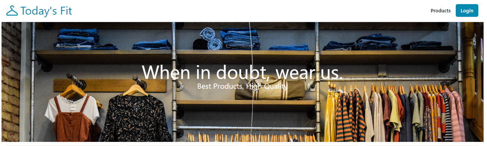
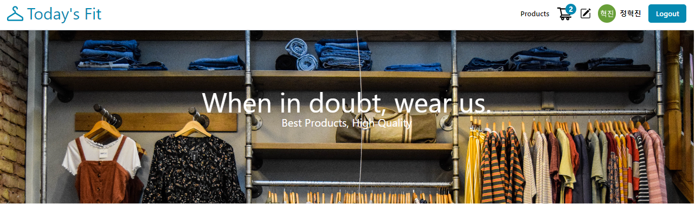
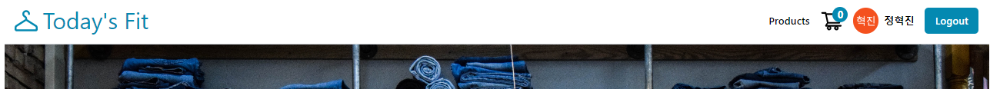
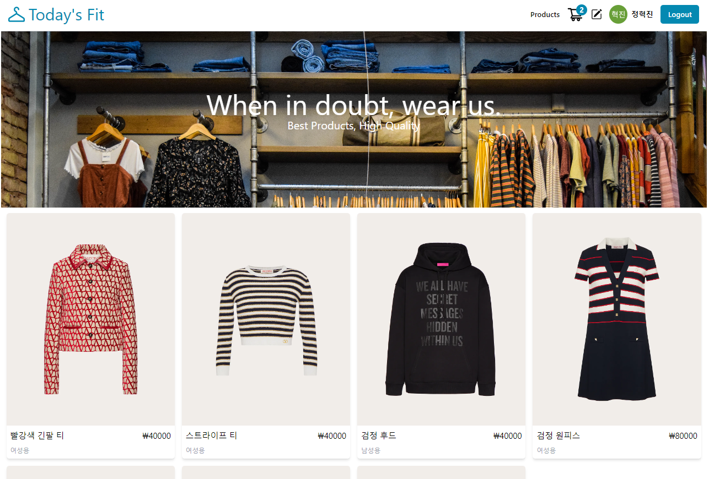
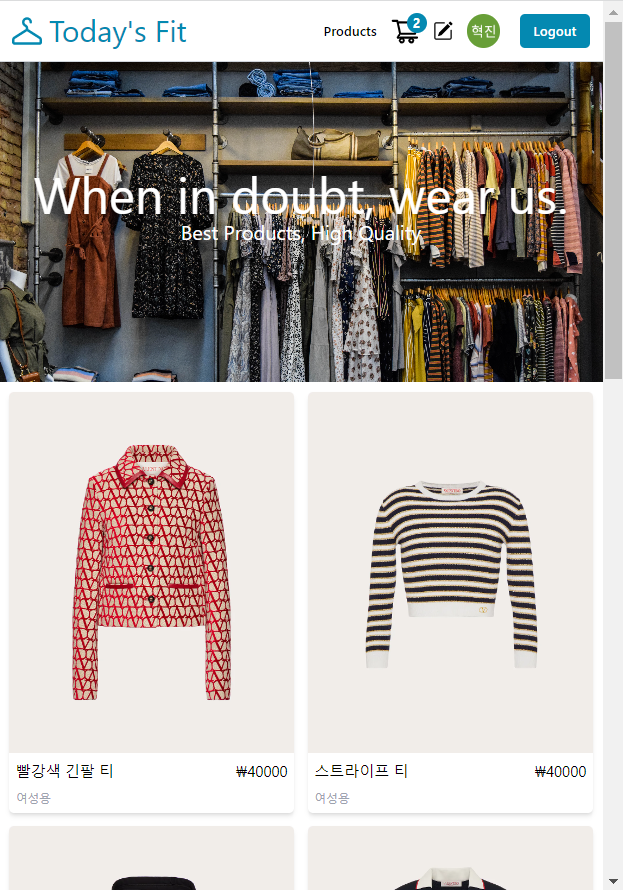
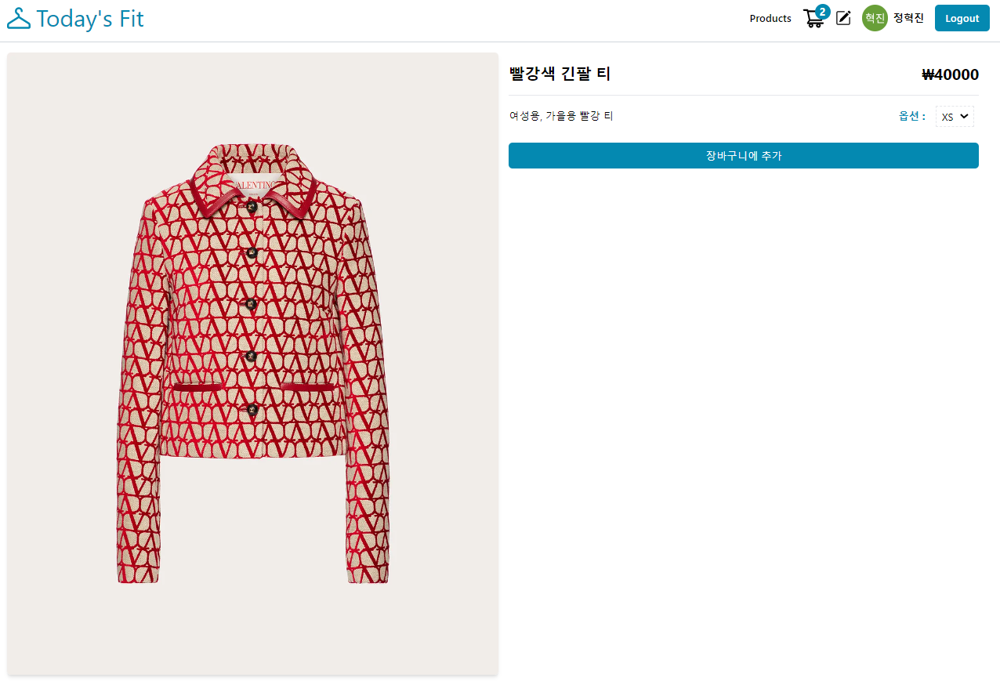
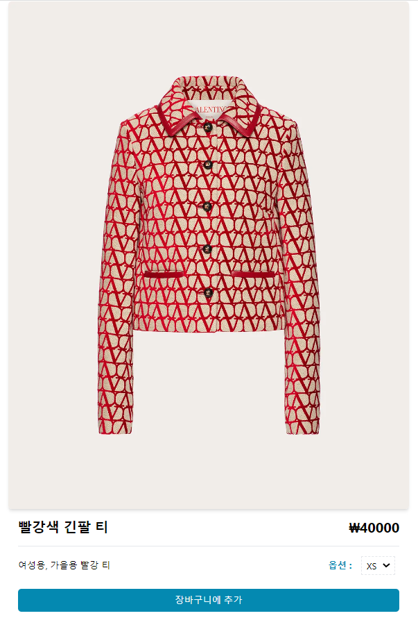
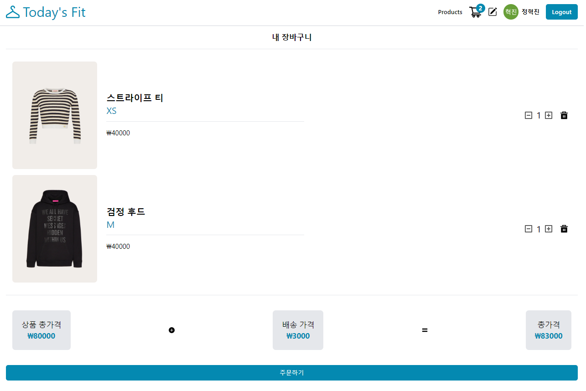

# Today's Fit - 온라인 의류 쇼핑몰 ( 2022.12.06 )

> ### 기술 스택 : React.JS, React Query, React Router, Cloudinary(Product Images), Firebase(Products DB),
> ### 스타일링 : Tailwind
> ### 외부 API : Google API (로그인, 로그아웃)

### 환경 설정
```
// 리액트 라우터, 리액트 아이콘 사용 설정
$ yarn add react-router-dom react-icons

// 스타일링
$ yarn add -D tailwindcss
$ npx tailwindcss init

// firebase 연동
$ yarn add firebase

// 고유 id세팅을 위한 uuid 설치
$ yarn add uuid

// 리액트 쿼리 설치
$ yarn add @tanstack/react-query
```

### Tailwind css 사용법
- $ npx tailwindcss init 후에 아래와 같이 환경설정이 따로 필요하다.
```js
// tailwind.config.js

/** @type {import('tailwindcss').Config} */
module.exports = {
  content: ['./src/**/*.{js, jsx}'], // 이 부분을 추가해줘야 한다.
  theme: {
    extend: {},
  },
  plugins: [],
}
```

```css
/* index.css */

/* index.css 최상단에 아래의 세가지 설정을 해줘야한다. */
@tailwind base;
@tailwind components;
@tailwind utilities;

body {
  margin: 0;
  font-family: -apple-system, BlinkMacSystemFont, 'Segoe UI', 'Roboto', 'Oxygen',
    'Ubuntu', 'Cantarell', 'Fira Sans', 'Droid Sans', 'Helvetica Neue',
    sans-serif;
  -webkit-font-smoothing: antialiased;
  -moz-osx-font-smoothing: grayscale;
}

code {
  font-family: source-code-pro, Menlo, Monaco, Consolas, 'Courier New',
    monospace;
}
```

## 구조 :
```js
// index.js
const router = createBrowserRouter([
  {
    path: "/",
    element: <App />,
    errorElement: <NotFound />,
    children: [
      {
        index: true,
        path: "/",
        element: <Home />,
      },
      {
        path: "/products",
        element: <AllProducts />,
      },
      {
        path: "/products/new",
        element: (
          <ProtectedRoute>
            {/* admin만 봐야함 */}
            <NewProduct />
          </ProtectedRoute>
        ),
      },
      {
        path: "/products/:id",
        element: <ProductDetail />,
      },
      {
        path: "/cart",
        element: (
          <ProtectedRoute>
            {/* 로그인 한 사용자만 봐야함 */}
            <MyCart />
          </ProtectedRoute>
        ),
      },
    ],
  },
]);

const root = ReactDOM.createRoot(document.getElementById("root"));
root.render(
  <React.StrictMode>
    <RouterProvider router={router} />
  </React.StrictMode>
);
```

```js
// App.js

function App() {
  const queryClient = new QueryClient();
  return (
    <QueryClientProvider client={queryClient}>
      <AuthContextProvider>
        <Navbar />
        <Outlet />
      </AuthContextProvider>
    </QueryClientProvider>
  );
}

export default App;
```
```markdown
- src
  - api
    - firebase.js
    - uploader.js
  - components
    - Banner.jsx
    - CartItem.jsx
    - CartStatus.jsx
    - Navbar.jsx
    - PriceCard.jsx
    - ProductCard.jsx
    - Products.jsx
    - User.jsx
    - ui
      - Button.jsx
  - context
    - AuthContext.jsx
  - hooks
    - useCart.jsx
    - useProducts.jsx
  - pages
    - AllProducts.jsx
    - Home.jsx
    - MyCard.jsx
    - NewProdut.jsx
    - NotFound.jsx
    - ProductDetail.jsx
    - ProtectedRoute.jsx
  - App.js
  - index.js
```
---
<br>

## 주요기능:
### *Header, Navbar*
- 로그인 전 : 장바구니 기능 없음, 구글 계정으로 로그인 가능
<br>

- 로그인(Admin) : 새 제품 추가 가능
<br>
- 로그인(User) : 제품 추가 기능 없음


```js
// 계정 관련
// firebase.js
import { initializeApp } from "firebase/app";
import { v4 as uuid } from "uuid";
import {
  getAuth,
  signInWithPopup,
  GoogleAuthProvider,
  signOut,
  onAuthStateChanged,
} from "firebase/auth";
import { getDatabase, ref, get, set, remove } from "firebase/database";

const firebaseConfig = {
  apiKey: process.env.REACT_APP_FIREBASE_API_KEY,
  authDomain: process.env.REACT_APP_FIREBASE_AUTH_DOMAIN,
  databaseURL: process.env.REACT_APP_FIREBASE_DB_URL,
  projectId: process.env.REACT_APP_FIREBASE_PROJECT_ID,
};

//firebase 초기화
const app = initializeApp(firebaseConfig);
// Google 공급자 개체를 사용하여 Firebase에 인증합니다.
// 팝업 창을 열거나 로그인 페이지로 리디렉션하여 사용자에게 Google 계정으로
// 로그인하도록 요청할 수 있습니다. 리디렉션 방법은 모바일 장치에서 선호됩니다
const auth = getAuth();
// google 공급자 개체의 인스턴스 만들기
const provider = new GoogleAuthProvider();
// firebase 실시간 데이터베이스 사용, admin관련 작업 전에 필요
const database = getDatabase(app);

export function login() {
  signInWithPopup(auth, provider);
}

export function logout() {
  signOut(auth);
}

// 인증 상태 관찰자 설정 및 사용자 데이터 가져오기
export function onUserStateChange(callback) {
  const auth = getAuth();
  onAuthStateChanged(auth, async (user) => {
    const updatedUser = user ? await adminUser(user) : null;
    callback(updatedUser);
  });
}

// firebase db에 있는 user 데이터 한번 읽어오기
async function adminUser(user) {
  return get(ref(database, "admins")) //
    .then((snapshot) => {
      if (snapshot.exists()) {
        // console.log('1', snapshot.val());
        const admins = snapshot.val();
        const isAdmin = admins.includes(user.uid);
        return { ...user, isAdmin };
      }
      return user;
    });
}

// 클라우디너리에 이미지 등록 후 url과 product 받아와 firebase에 업데이트
export async function addNewProduct(product, imageUrl) {
  const id = uuid();
  return set(ref(database, `products/${id}`), {
    ...product,
    id,
    price: parseInt(product.price),
    imageUrl,
    options: product.options.split(","),
  });
}

// firebase db에 있는 데이터 가져오기.
export async function getProducts() {
  return get(ref(database, "products")) //
    .then((snapshot) => {
      if (snapshot.exists()) {
        return Object.values(snapshot.val());
      }
      return [];
    });
}

// cart 제품 정보 가져오기
export async function getCart(userId) {
  return get(ref(database, `cart/${userId}`)) //
    .then((snapshot) => {
      const items = snapshot.val() || {};
      return Object.values(items);
    });
}

// cart에 제품 추가하기
export async function addOrUpdateCart(userId, product) {
  return set(ref(database, `cart/${userId}/${product.id}`), product);
}

// cart에 제품 삭제하기
export async function removeCart(userId, productId) {
  return remove(ref(database, `cart/${userId}/${productId}`));
}
```

```js
// AuthContext.jsx
const AuthContext = createContext();

export function AuthContextProvider({ children }) {
  const [user, setUser] = useState();

  // 사용자 정보가 남아있다면 로그인 유지
  useEffect(() => {
    onUserStateChange((user) => {
      // console.log('3',user.uid);
      setUser(user);
    });
  }, []);
  return (
    <AuthContext.Provider value={{ user, login, logout, uid: user && user.uid}}>
      {children}
    </AuthContext.Provider>
  );
}

export function useAuthContext() {
  return useContext(AuthContext);
}
```

```js
// Navbar.jsx
export default function Navbar() {
  const { user, login, logout } = useAuthContext();

  return (
    <header className="flex justify-between border-b border-gray-300 p-4">
      <Link
        to="/"
        className="flex items-center text-4xl text-brand gap-2 mr-10"
      >
        <svg>...</svg>
        <p className="whitespace-nowrap ">Today's Fit</p>
      </Link>
      <nav className="flex items-center gap-4 font-semibold">
        <Link to="/products">Products</Link>
        {user && (
          <Link to="/cart">
            <CartStatus />
          </Link>
        )}
        {user && user.isAdmin && (
          <Link to="/products/new">
            <BsPencilSquare className="text-2xl" />
          </Link>
        )}
        {user && <User user={user} />}
        {!user && <Button onClick={login} text="Login" />}
        {user && <Button onClick={logout} text="Logout" />}
      </nav>
    </header>
  );
}
```
---
<br>

### *Home*
- 메인 페이지 - 반응형 
<br>

- 스크린 축소 시 계정 이름 hidden, 이미지만 보이게 함
<br>

```js
// Home.jsx
export default function Home() {
  return (
    <>
      <Banner />
      <Products />
    </>
  )
}
```

```js
// Products.jsx
export default function Products() {
  const {
    productsQuery: { isLoading, error, data: products },
  } = useProducts();
  return (
    <>
      {isLoading && <p>isLoading...</p>}
      {error && <p>{error}</p>}
      <ul className="grid grid-cols-1 sm:grid-cols-2 md:grid-cols-3 lg:grid-cols-4 gap-4 p-3">
        {products &&
          products.map((product) => (
            <ProductCard key={product.id} product={product} />
          ))}
      </ul>
    </>
  );
}
```
---
<br>

### *제품 상세*
- 제품 상세정보, 옵션 설정, 장바구니에 추가

<br>

```js
// ProductDetail.jsx
export default function ProductDetail() {
  const { addOrUpdateItem } = useCart();
  const [success, setSuccess] = useState('');
  const [disabled, setDisabled] = useState(false);
  const {
    state: {
      product: { id, imageUrl, title, description, category, price, options },
    },
  } = useLocation();

  const [selected, setSelected] = useState(options[0]);
  const selectHandler = (e) => {
    // 옵션 선택
    setSelected(e.target.value);
  };

  const clickHandler = () => {
    // 장바구니 추가
    const product = {
      id,
      imageUrl,
      title,
      description,
      category,
      price,
      option: selected,
      quantity: 1,
    };
    addOrUpdateItem.mutate(product, { onSuccess: () => {
      setDisabled(true); // 버튼 비활성화
      setSuccess('장바구니에 성공적으로 추가되었습니다! :]');
      setTimeout(()=>{
        setSuccess('');
        setDisabled(false);
      },3000)
    } });
    
  };

  return (
    <section className="w-full p-4 flex flex-col lg:flex-row ">
      
      <div className="w-full flex flex-col p-4">
        <div className="w-full flex justify-between border-b pb-4">
          <p className="text-2xl font-bold">{title}</p>
          <p className="text-2xl font-bold">{`₩${price}`}</p>
        </div>
        <div className="w-full flex justify-between items-center pt-2 pb-4">
          <p className="">
            {category}, {description}
          </p>
          <div className="flex gap-2 items-center">
            <label htmlFor="select" className="text-brand font-bold">
              옵션 :{" "}
            </label>
            <select
              id="select"
              className="border-dashed border-2 p-1 m-2"
              onChange={selectHandler}
              value={selected}
            >
              {options.map((option, index) => (
                <option key={index}>{option}</option>
              ))}
            </select>
          </div>
        </div>
        {success&&<p>{success}</p>}
        <Button text="장바구니에 추가" onClick={clickHandler} disabled={disabled}/>
      </div>
    </section>
  );
}
```
---
<br>

### *장바구니*
- 상품 결제


```js
// MyCart.jsx
const SHIPPING_PRICE = 3000;
export default function MyCart() {
  const {
    cartQuery: { data: products, isLoading },
  } = useCart();

  if (isLoading) {
    return <p>Loading...</p>;
  }

  const hasProducts = products && products.length > 0;
  const totalPrice = products.reduce(
    (prev, current) => prev + parseInt(current.price) * current.quantity,
    0
  );

  const orderHandler = () => {};

  return (
    <section className="px-4 pb-12 flex flex-col ">
      {!hasProducts && <p>장바구니에 상품이 없습니다..!</p>}
      {hasProducts && (
        <>
          <p className="text-center p-4 border-b font-bold text-xl">
            내 장바구니
          </p>
          <ul className="border-b p-4">
            {products &&
              products.map((product) => (
                <CartItem key={product.id} product={product} />
              ))}
          </ul>
          <div className="flex justify-between items-center m-4">
            <PriceCard text={"상품 총가격"} price={totalPrice} />
            <BsFillPlusCircleFill className="shrink-0" />
            <PriceCard text={"배송 가격"} price={SHIPPING_PRICE} />
            <FaEquals className="shrink-0" />
            <PriceCard text={"총가격"} price={totalPrice + SHIPPING_PRICE} />
          </div>
          <Button text="주문하기" onClick={orderHandler} />
        </>
      )}
    </section>
  );
}
```