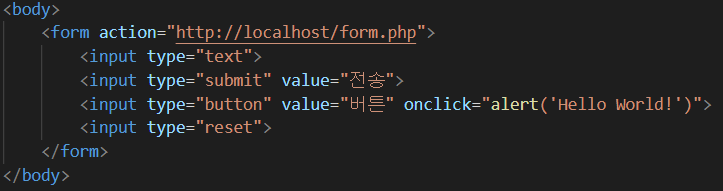
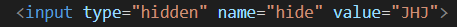
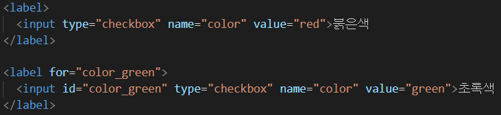
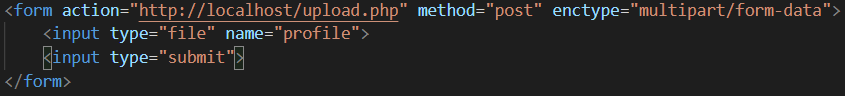
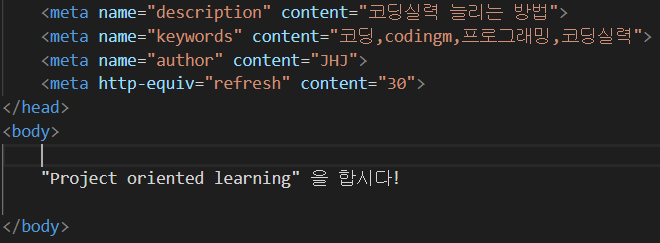
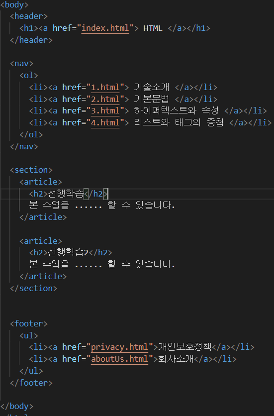
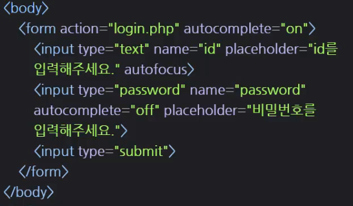
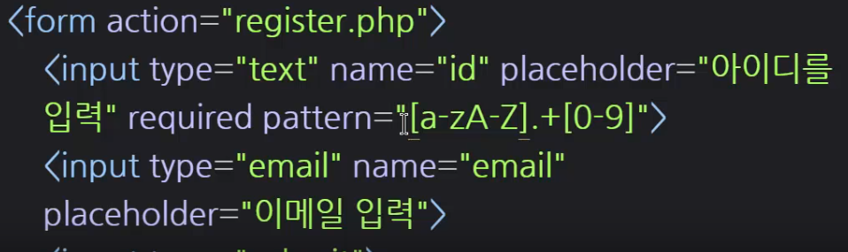

# 	*HTML*

`<a href=""> 내용 </a>`  

- "안에 링크 주소사용"

`<a href="" target="_blank" > 내용 </a>`  

- target속성에 blank값을 넣으면, 내용이 새 페이지에서 열림.

`<a href="" title="" > 내용 </a>`  

- title속성을 넣고 내용에 마우스를 올리면 title속성의 ""안의 값이 작은 문자로 나타남.

`<li> 내용 </li>`  (list) 

- 브라우저에 검정색 점으로

`<ul> 내용 </ul>`  (unordered list)   

- `<li>` 태그를 그룹핑 해준다.

`<ol> 내용 <ol>`  (ordered list) 

- `<li>` 태그의  내용을 숫자로 바꿔줌.

`<meta charset = "utf-8">`

- meta charset은 웹페이지의 글자가 깨지면 사용. `<head>`안에 고정으로 사용.

`<head> `

`<title> HTML </title>`

`<meta charset = "utf-8">`

` </head>`

- head는 본문이 아닌 부가적인 정보를 담을 때 사용. 

`<body>`

- 본문의 내용이 들어감!

`</body>` 

`<!DOCTYPE html>`

`<html>`

`<head>    </head>`

`<body>    </body>`

`</html>`

- 웹페이지 구조

`
 내용 
`
- 단락(paragraph)의 뜻.
- html은 줄바꿈을 무시함. so, 단락의 시작과 끝에 p태그로 감싸주면 단락이 보기좋게 나눠짐.

` `
- A forced line-break: 강제 줄바꿈.
- 내용 끝에 ` `태그 하나만 쓰면 됨.
- `  ` (많이 사용할수록)간격이 더 넓어짐.

``

- src: (source)의 줄임말, ""에 이미지가 저장된 이름과 확장자명을 씀.
- width 와 height 는 넓이와 높이를 정함. 픽셀이나, %로 사용 가능.
- alt: (alternative text)의 줄임말. 대안, 대체제라는 뜻.
- title: 이미지 위에 마우스오버(hover)를 하면, ""내용이 표시됨.

`<form action="http://localhost/login.php">`을 만들고 submit를 사용하면 ""안의 사이트로 이동 됨.

`<select name="color">
	<option value="green">초록색</option>
	<option value="black">검정색</option>
	<option value="white">흰색</option>
</select>`

- dropdown list생성.  한개 선택 가능.

`<select name="color2" multiple>
	<option value="green">초록색</option>
	<option value="black">검정색</option>
	<option value="white">흰색</option>
</select>`

- 다중선택 가능 (많이 사용하지 않음.)

`초록색: <input type="radio" name="color2" id="">`

`검정색: <input type="radio" name="color2" id="" checked>`

- name이 같으면 하나만 선택가능.
- checked를 사용하면 default 값으로 체크가 되어있음.

- input type="checkbox"로 사용시, 다중 선택 가능.

- 버튼 클릭시 (' ')문구가 나옴.
- input type="reset"은 초기화 버튼 생성.

- UI가 보이지 않지만 서버로 어떤 값을 보이지 않게 전송하고 싶을 때, 히든이라는 타입의 인풋태그를 사용하면 된다.

- `<label>` 태그.
- checkbox를 클릭하지 않고, "붉은색" 단어를 클릭해도 체크박스가 클릭 됨. 

`<form action="http://localhost/login.php" method="post">`

- method를 지정하지 않으면 기본적으로 get방식으로 사용.

  post 방식을 사용하면 url뒤에 데이터 노출을 하지 않고 숨겨서 보냄.

- form 맨 뒤 enctype은 그냥 사용한다고 생각하자.
- input type을 file로 지정하면 파일을 업로드 할 수 있다.

`HelloWorld!`

- font속성은 거의 사용하지 않음. (꾸미기는 css를 활용.)

- description은 나중에 이 자료의 설명 or 요약내용을 보고싶으면 활용할 수 있음.
- keywords는 웹브라우저에서 해당 단어들을 검색하면 이 자료를 찾을 수 있음.
- 전부 사용자가 쓰기 나름.
- http-equiv=refresh는 웹사이트를 30초마다 새로고침.

 

- `<body>`안의`<header>`는 가장 중요한 정보가 들어있는, 사이트 전체에 대한 정보가 표현되는 부분.
- `<nav>`태그로 네비게이션 역할 수행.
- 본문은 `<article>`로 감싸주고, `<article>`들은 `<section>`으로 묶어준다.
- `<footer>`는 웹사이트 맨 하단에서 볼 수 있음.

- 추가된 input type들

- autocomplete : 자동완성기능
- autofocus : 웹사이트를 키면 id text칸에 자동으로 타이핑 커서가 깜빡거림.
- placeholder :  text box안에 반투명하게 정보가 들어있음.

- required를 사용하면, 해당 정보는 무조건 입력해야 됨.

- pattern = 정규표현식 -> 사용해야하는 값을 정해줌.

- . 은 어떤 문자도 상관없다.
- +는 어떤 문자든 하나 이상이 와야 됨.