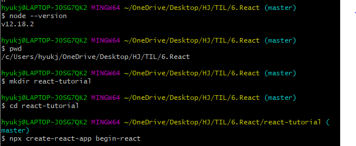
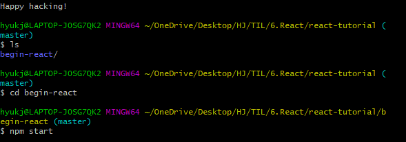
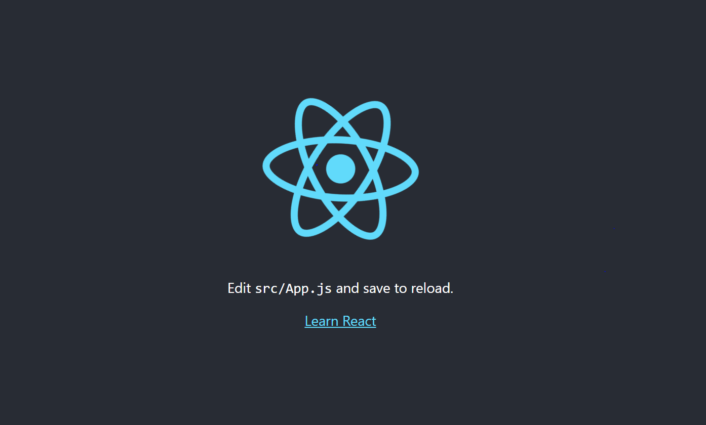

# React 입문

#### 첫 시작, 환경설정

> 원하는 폴더에서 gitbash를 실행 후,

> node --version
>
> > 노드 버전 확인

> npm --version
>
> > npm버전 확인

> pwd 
>
> > 현재위치 확인

> mkdir 폴더이름
>
> > 폴더이름 폴더생성

> cd 폴더이름
>
> > 폴더이름으로 현재위치 이동

> npx creat-react-app 폴더이름
>
> > 폴더이름의 리액트 앱 설치

> ls
>
> > 현재 디렉토리에 뭐가 있나 확인

> cd 폴더이름
>
> > 폴더이름으로 이동

> npm start
>
> > 새로운 브라우저 창이 뜨면서 리액트 앱이 실행된다.

> 브라우저에서 앱이 정상적으로 작동한다면, 준비완료. 

