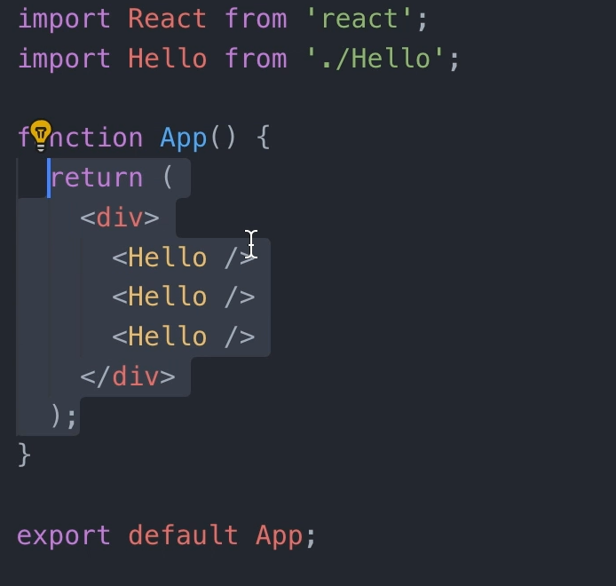
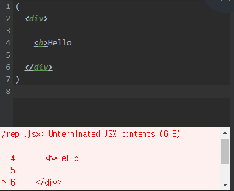
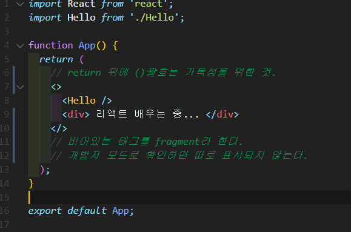
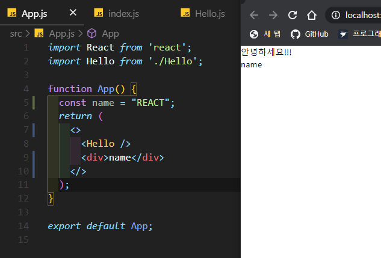
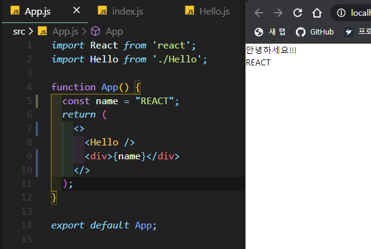
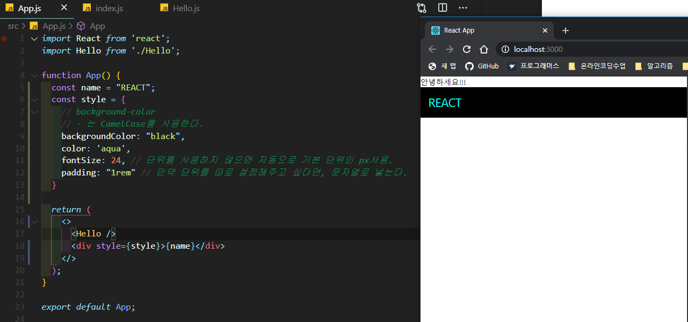
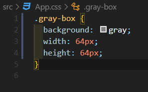
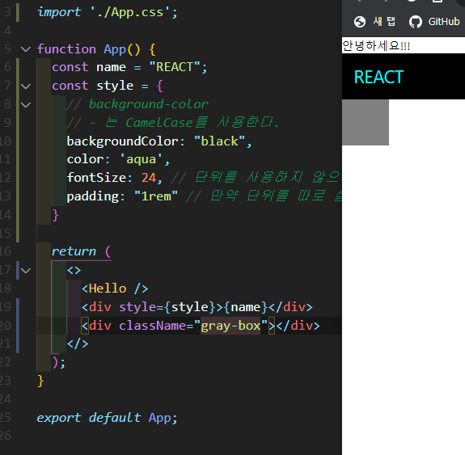
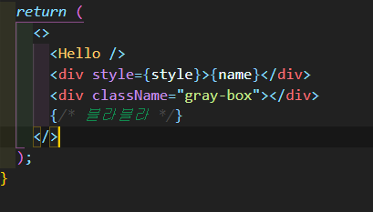

# JSX의 기본 규칙 알아보기

> React component를 만들때 사용하는 문법이다.




- HTML처럼 생겼지만, 사실은 JavaScript이다.
- Babel이란 도구를 사용해서 XML형태의 코드가 자바스크립트로 변환되는 것이다.

> https://babeljs.io/  -> Try it out에서 확인해볼 수 있다.


- JSX로 작성한 코드가 JS로 제대로 변환이 되려면, 준수해야 될 규칙들이 있다.

  1. 태그는 꼭 닫혀있어야 한다. 닫지 않으면 에러발생. 

     (태그 사이에 아무것도 없다면, 셀프 클로징 태그를 사용한다. 

     ```js
     // ex) 
     <br />
     ```

  

  

  2. 두개 이상의 태그는 꼭 하나의 태그로 감싸야 한다.

     

     

  3. JSX내부에서 JS값을 사용하는 방법

     

     - 단순히 name이라고 치면, 문자열이 나타난다.
     - 하지만, { }중괄호로 감싸면, 실제 name값이 가리키는 "REACT"라는 값이 나타난다.

     

     

  4. style과 class 이름을 설정하려면 객체를 만들어야 한다.

     

      

> className이 아닌 class라고 써도 작동은 하지만, 콘솔창에 에러가 뜬다.


  6. JSX에서 주석 사용방법

     