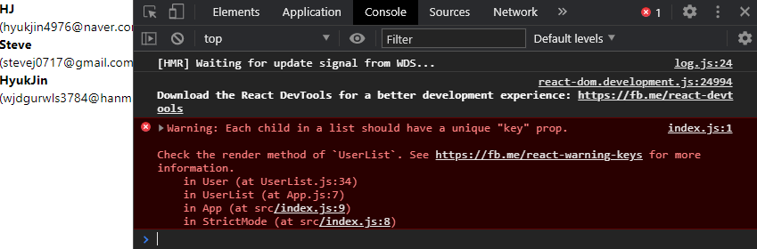

## 배열 렌더링

```js
// UserList.js

import React from 'react';

function UserList() {
  //
  const users = [
    {
      id: 1,
      username: 'HJ',
      email: 'hyukjin4976@naver.com',
    },
    {
      id: 2,
      username: 'Steve',
      email: 'stevej0717@gmail.com',
    },
    {
      id: 3,
      username: 'HyukJin',
      email: 'wjdgurwls3784@hanmail.com',
    },
  ];

  return (
    <div>
      <div>
        <b>{users[0].username}</b> <span>({users[0].email})</span>
      </div>
      <div>
        <b>{users[1].username}</b> <span>({users[1].email})</span>
      </div>
      <div>
        <b>{users[2].username}</b> <span>({users[2].email})</span>
      </div>
    </div>
  );
}

export default UserList;
```

- 같은 코드를 세번이나 썼다.

or

- 밑에 방법으로도 가능하지만, 역시 코드가 반복된다.

```js
// UserList.js

import React from 'react';

// User 컴포넌트 생성
function User({ user }) {
  return (
    <div>
      <b>{user.username}</b> <span>({user.email})</span>
    </div>
  );
}

function UserList() {
  //
  const users = [
    {
      id: 1,
      username: 'HJ',
      email: 'hyukjin4976@naver.com',
    },
    {
      id: 2,
      username: 'Steve',
      email: 'stevej0717@gmail.com',
    },
    {
      id: 3,
      username: 'HyukJin',
      email: 'wjdgurwls3784@hanmail.com',
    },
  ];

  return (
    <div>
      <User user={users[0]} />
      <User user={users[1]} />
      <User user={users[2]} />
    </div>
  );
}

export default UserList;

```

- 이런식으로 고정적인 배열에는 쉽게 사용할 수 있지만, 만약 배열이 늘어나거나 줄어들어 내용이 바뀐다면,
- 위에 방식보다는 JS의 내장함수인 map()을 사용하자!

```js
return (
    <div>
      {users.map((user) => (
        <User user={user} />
      ))}
    </div>
  );
```

- 이런식으로 사용해도 결과는 똑같이 나온다, 하지만 개발자모드 console칸을 보면 이러한 에러가 뜬다.



- Each child는 각 User를 뜻하고, 'key'라는 prop이 필요하다고 한다.
  - 'key' prop의 역할은 각 원소들마다 고유값을 줌으로써 리렌더링 성능을 최적화 할 수 있게 해주는 것이다.

- 위에서 확인해보면 각 User가 가지고 있는 고유값은 id이다. 그러면 id값을 key로 설정해줘야 한다.

```js
return (
    <div>
      {users.map((user) => (
        <User user={user} key={user.id} />
      ))}
    </div>
  );
```

- 위처럼 key값을 지정해주면, 에러가 없어진 것을 확인할 수 있다.


- 가끔 key로 사용할 고유값이 없는 경우에는, map에서 사용하는 콜백함수의 두번재 parameter인 index값을 사용해도 된다. 하지만, index를 사용하면 경고만 사라질 뿐, 성능적으로 좋아지는 것은 아니다.

```js
return (
    <div>
      {users.map((user, index) => (
        <User user={user} key={index} />
      ))}
    </div>
  );
```

