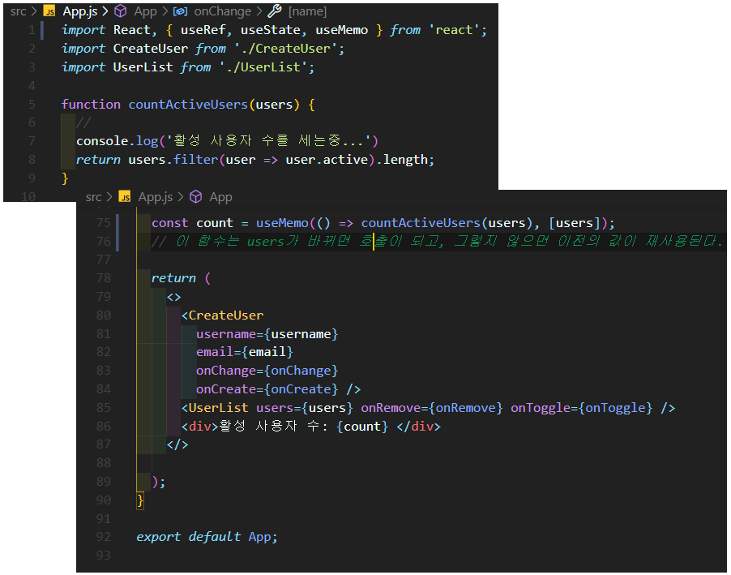
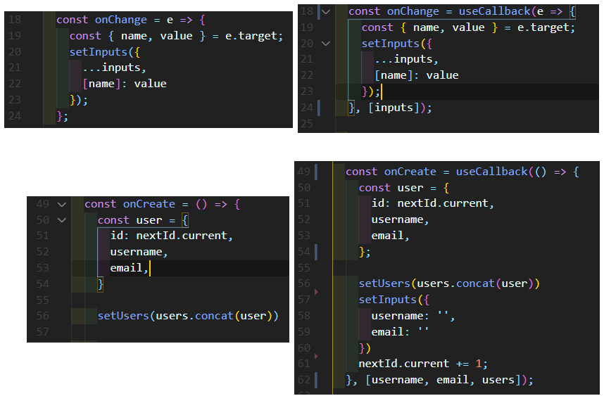
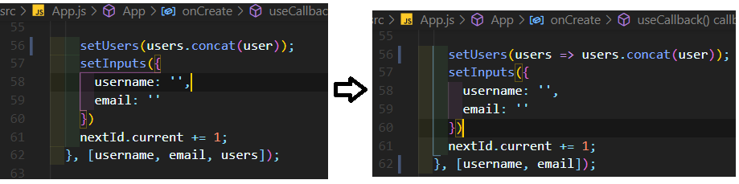
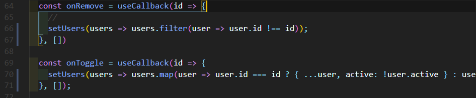
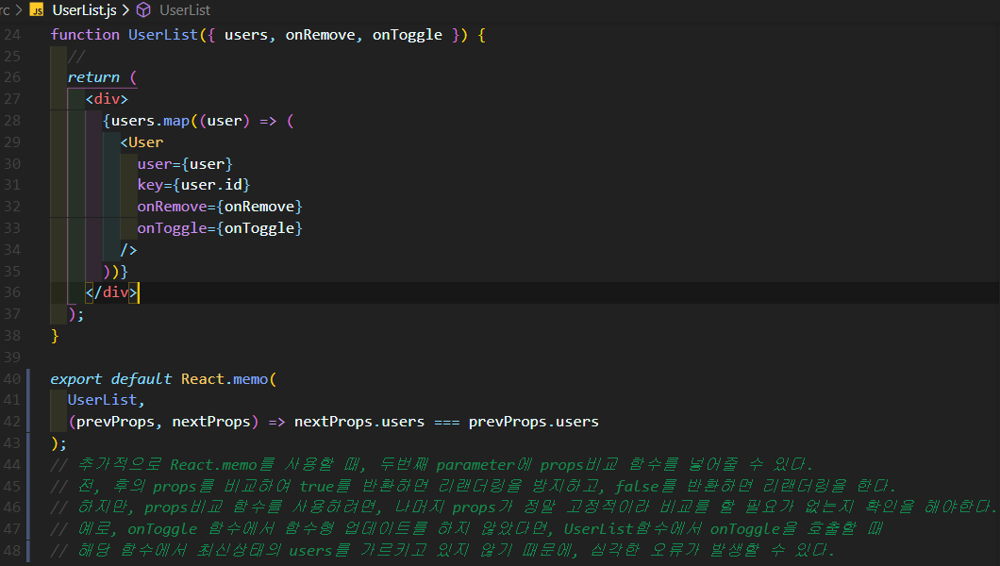
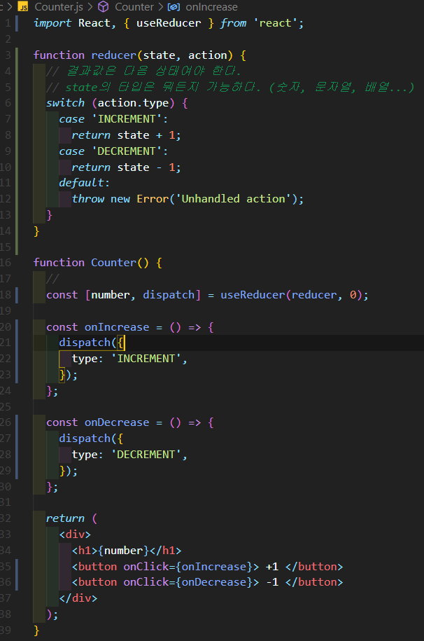

## 1. useEffect Hook

> 화면에 보여지는 리액트 컴포넌트에 특정 작업을 할 수 있고, props나 상태가 변경되서 업데이트 될 때도 작업이 가능. 리랜더링 될 때마다 어떤 작업을 등록 가능.

#### useEffect() 함수에서 deps가 없는 경우

```js
// UserList.js

import React, { useEffect } from 'react';

function User({ user, onRemove, onToggle }) {
  const { username, email, id, active } = user;

  useEffect(() => {
    console.log('컴포넌트가 화면에 나타남');
    // 두번째 parameter는 배열을 넣어주는데, 이 배열을 deps라고 부른다. dependency라는 뜻.
    // 의존되는 값들을 배열안에 넣어주면 된다. 비어있으면 컴포넌트가 처음 화면에 나타날 때만
    // 실행이 된다.
    return () => {
      console.log('컴포넌트가 화면에서 사라짐');
      // 클리너 함수를 뒷정리 함수라고도 부른다.
    };
  }, []);
  return (
    <div>
      <b
        style={{
          color: active ? 'green' : 'black',
          cursor: 'pointer',
        }}
        onClick={() => onToggle(id)}
      >
        {username}
      </b>
      &nbsp;
      <span>({email})</span>
      <button onClick={() => onRemove(id)}>삭제</button>
    </div>
  );
}

function UserList({ users, onRemove, onToggle }) {
  //
  return (
    <div>
      {users.map((user) => (
        <User
          user={user}
          key={user.id}
          onRemove={onRemove}
          onToggle={onToggle}
        />
      ))}
    </div>
  );
}

export default UserList;
```

---

#### 컴포넌트가 마운트 될 때, 주로 추가하는 작업은...

- props로 받은 값을 컴포넌트의 state로 설정
- REST API, 외부 API요청, 특정 API요청할 때,
- D3, Video.js 등의 라이브러리 사용할 때,

- setInterval, setTimeout  등의 작업

> useEffect에서 함수가 호출되는 시점에서는, UI가 화면에 나타난 상태 이후다.
>
> 그래서, DOM에 바로 접근해도 된다.

#### 컴포넌트가 언마운트 될 때, 주로 하는 작업은...

- clearInterval, clearTimeout 등의 작업
- 라이브러리 인스턴스 제거

---


#### useEffect() 함수에서 deps가 있는 경우

```js
// UserList.js

import React, { useEffect } from 'react';

function User({ user, onRemove, onToggle }) {
  const { username, email, id, active } = user;

  useEffect(() => {
    console.log('user값이 설정됨');
    console.log(user);
    return () => {
      console.log('user값이 바뀌기 전');
      console.log(user);
    };
  }, [user]);
  // useEffect의 함수는, deps값인 [user]가 설정되거나 변경될 때마다 호출이 된다.
  // 처음 화면에 나타날 때에도 호출이 된다는 것을 알고있자.
  // useEffect 함수에서 props로 받아온 값을 참조하거나, useState로 관리하고 있는 값을
  // 참조하고 있는 경우에는 deps배열을 꼭 넣어주어야 한다.
  // 넣지 않으면 오류가 나진 않지만, 경고가 뜬다.

  return (
    <div>
      <b
        style={{
          color: active ? 'green' : 'black',
          cursor: 'pointer',
        }}
        onClick={() => onToggle(id)}
      >
        {username}
      </b>
      &nbsp;
      <span>({email})</span>
      <button onClick={() => onRemove(id)}>삭제</button>
    </div>
  );
}

function UserList({ users, onRemove, onToggle }) {
  //
  return (
    <div>
      {users.map((user) => (
        <User
          user={user}
          key={user.id}
          onRemove={onRemove}
          onToggle={onToggle}
        />
      ))}
    </div>
  );
}

export default UserList;

```

---

---


## 2. useMemo Hook

> 이전에 연산된 값을 재사용하는 방법
>
> 주로, 성능을 최적화해야 하는 경우에 사용한다

#### useMemo를 사용하지 않았을 경우


- {name, value} 를 가져와서 input 상태를 바꾸고 있는데, onChange 이벤트를 발생시켜도 컴포넌트는 리랜더링 된다. 그래서, 리랜더링이 될 때마다 활성 사용자 수를 센다. (불필요한 동작)
- 이럴때 사용할 수 있는게 useMemo이다.
- 특정 값이 바뀌었을 때만 특정 함수를 실행해서 연산하도록 처리하고, 원하는 값이 변경되지 않았다면 이전에 만들어놨던 값을 재사용 할 수 있게 해준다.

---

#### useMemo를 사용한 경우



- 리랜더링이 돼도 불필요한 호출은 하지 않는다.

---
---


## 3. useCallback Hook

> 이전에 만들었던 함수를 새로 만들지않고 재사용 할 수 있다.
>
> useMemo랑 비슷하지만 함수를 위한 hook이다.

```js
// App.js

import React, { useRef, useState, useMemo } from 'react';
import CreateUser from './CreateUser';
import UserList from './UserList';

function countActiveUsers(users) {
  //
  console.log('활성 사용자 수를 세는중...')
  return users.filter(user => user.active).length;
}

function App() {
  //
  const [inputs, setInputs] = useState({
    username: '',
    email: '',
  });
  const { username, email } = inputs;
  const onChange = e => {
    const { name, value } = e.target;
    setInputs({
      ...inputs,
      [name]: value
    });
  };

  const [users, setUsers] = useState([
    {
      id: 1,
      username: 'HJ',
      email: 'hyukjin4976@naver.com',
      active: true,
    },
    {
      id: 2,
      username: 'Steve',
      email: 'stevej0717@gmail.com',
      active: false,
    },
    {
      id: 3,
      username: 'HyukJin',
      email: 'wjdgurwls3784@hanmail.com',
      active: false,
    },
  ]);

  const nextId = useRef(4);

  const onCreate = () => {
    const user = {
      id: nextId.current,
      username,
      email,
    }

    setUsers(users.concat(user))

    setInputs({
      username: '',
      email: ''
    })
    console.log(nextId.current);
    nextId.current += 1;
  }

  const onRemove = id => {
    //
    setUsers(users.filter(user => user.id !== id));
  }

  const onToggle = id => {
    setUsers(users.map(user => user.id === id ? { ...user, active: !user.active } : user));
  }

  const count = useMemo(() => countActiveUsers(users), [users]);

  return (
    <>
      <CreateUser
        username={username}
        email={email}
        onChange={onChange}
        onCreate={onCreate} />
      <UserList users={users} onRemove={onRemove} onToggle={onToggle} />
      <div>활성 사용자 수: {count} </div>
    </>

  );
}

export default App;

```

- 위에 함수들을 보면 컴포넌트가 리랜더링 될 때마다 새로운 함수를 만들고 있다.
- 함수를 새로 만드는 것 자체는 메모리와 cpu가 리소스를  많이 차지하는 작업은 아니지만, 한 번 만든 함수는 재사용할 수 있다면 하는 것이 좋다. 그 이유는, 컴포넌트들이 props가 바뀌지 않았다면 Virtual DOM에서 하는 리랜더링조차 안하게끔 만들어 줄 수 있다. 
- 하지만, 그 작업을 하려면 위처럼 매번 함수가 새로 만들어지는 구조면 최적화를 하지 못한다. 



- 왼쪽 함수를 오른쪽 함수로 바꿔준다.

- username, email 같은 경우는 input에서 바깥으로 빼내준 값이지만 결국 상태이기 때문에, deps배열에 넣어주어야 한다.
- 만약 넣지 않는다면, 함수 내부에서 해당 상태들을 참조하게 될 때, 가장 최신 상태를 참조하지 않고, 처음 만들어질 때의 컴포넌트 상태를 참조하게 된다.
- useCallback 내부에서 참조하게 되는 상태나 props로 받아온 값이 있다면, deps배열에 꼭 넣어주어야 한다.
- 함수를 props로 받아와도 똑같이 해줘야 한다.

---

---


## 4. React.memo 

> 컴포넌트에서 리랜더링이 불필요할 때 이전에 랜더링 했던 결과를 재사용 할 수 있게 하는 방법을 알아보자.
>
> 컴포넌트의 리랜더링 성능을 최적화 할 수 있다!

- 방법은 굉장히 쉽다.

```js
export default React.memo(UserList);
```

- 컴포넌트를 내보낼 때 React.memo()로 감싸주면 된다.
- React.memo()를 사용하면 props가 바뀌었을 때만 리랜더링을 한다. 최적화 끝!

- 하지만, 필요한 작업이 몇가지 더 있다. 아래 코드와 방법을 확인해보자.

 ```js
// App.js

import React, { useRef, useState, useMemo, useCallback } from 'react';
import CreateUser from './CreateUser';
import UserList from './UserList';

function countActiveUsers(users) {
  //
  console.log('활성 사용자 수를 세는중...')
  return users.filter(user => user.active).length;
}

function App() {
  //
  const [inputs, setInputs] = useState({
    username: '',
    email: '',
  });
  const { username, email } = inputs;
  const onChange = useCallback(e => {
    const { name, value } = e.target;
    setInputs({
      ...inputs,
      [name]: value
    });
  }, [inputs]);

  const [users, setUsers] = useState([
    {
      id: 1,
      username: 'HJ',
      email: 'hyukjin4976@naver.com',
      active: true,
    },
    {
      id: 2,
      username: 'Steve',
      email: 'stevej0717@gmail.com',
      active: false,
    },
    {
      id: 3,
      username: 'HyukJin',
      email: 'wjdgurwls3784@hanmail.com',
      active: false,
    },
  ]);

  const nextId = useRef(4);

  const onCreate = useCallback(() => {
    const user = {
      id: nextId.current,
      username,
      email,
    };

    setUsers(users.concat(user))
    setInputs({
      username: '',
      email: ''
    })
    nextId.current += 1;
  }, [username, email, users]);

  const onRemove = useCallback(id => {
    //
    setUsers(users.filter(user => user.id !== id));
  }, [users])

  const onToggle = useCallback(id => {
    setUsers(users.map(user => user.id === id ? { ...user, active: !user.active } : user));
  }, [users]);

  const count = useMemo(() => countActiveUsers(users), [users]);

  return (
    <>
      <CreateUser
        username={username}
        email={email}
        onChange={onChange}
        onCreate={onCreate} />
      <UserList users={users} onRemove={onRemove} onToggle={onToggle} />
      <div>활성 사용자 수: {count} </div>
    </>

  );
}

export default App;

 ```

```js
// UserList.js

import React from 'react';

const User = React.memo(function User({ user, onRemove, onToggle }) {
  const { username, email, id, active } = user;

  return (
    <div>
      <b
        style={{
          color: active ? 'green' : 'black',
          cursor: 'pointer',
        }}
        onClick={() => onToggle(id)}
      >
        {username}
      </b>
      &nbsp;
      <span>({email})</span>
      <button onClick={() => onRemove(id)}>삭제</button>
    </div>
  );
});

function UserList({ users, onRemove, onToggle }) {
  //
  return (
    <div>
      {users.map((user) => (
        <User
          user={user}
          key={user.id}
          onRemove={onRemove}
          onToggle={onToggle}
        />
      ))}
    </div>
  );
}

export default React.memo(UserList);

```

- App.js파일에서 UserList 컴포넌트에는 onRemove와 onToggle을 전달한다.
- UserList.js파일에서 User컴포넌트랑 UserList에 React.memo를 넣어줘서, 만약 props가 바뀌지 않았다면 리랜더링을 방지하도록 설정했다.
- 하지만, App.js파일에서 onRemove 와 onToggle을 보면 users가 deps에 있다. 즉, users배열이 바뀌면 이 둘도 바뀌고 UserList는 이 둘이 바뀌었으니 내부에 있는 것들을 리랜더링 할 것이고, UserList.js파일에서 User도 이 둘이 바뀌었으니 리랜더링을 할 것이다.
  - 이 문제를 해결하려면, onToggle, onRemove, onCreate 등의 함수들에서 기존 users를 참조하면 안된다.
  - 그렇기 때문에, useState의 함수형 업데이트를 해줘야 한다.


- 아래는 onCreate()함수의 일부다.



- 함수형 업데이트를 하면 deps에 users를 안넣어도 된다.

- setUsers에 등록한 콜백함수의 parameter에서 최신 users를 조회하기 때문에 굳이 deps에 users를 넣지 않아도 된다.
- 결국, onCreate()함수는 username과 email이 바뀔 때에만 새로 만들어진다.



- 이런식으로 다 바꿔주면 된다.
- 아래는 props비교 함수를 사용하는 방법이다.



- 성능 최적화는 모든 곳에 사용한다고 좋은게 아니다. 필요한 곳만 사용하자!!!

---

---


## 5. useReducer Hook (reducer: 상태를 업데이트 하는 함수)

- 이전에는 컴포넌트의 상태를 업데이트 할 때 useState를 사용해서 새로운 상태를 설정했다. useState말고도 useReducer Hook을 사용해서 상태를 업데이트 할 수 있다.
- 차이는 
  - useState는 설정하고 싶은 다음 상태를 직접 지정해주는 방식이다. ex) setValue(5)
  - useReducer는 action이라는 객체를 기반으로 상태를 업데이트 한다. 
    - ex) dispatch({ type: 'Increment, diff: 4 })
    - action객체는 업데이트 할 때 참조하는 객체이다.
    -  type이라는 값을 사용해서 어떤 업데이트를 진행할 것인지 명시할 수 있고, 업데이트 할 때 필요한 참조하고 싶은 다른 값이 있다면 이 객체안에 넣어줄 수도 있다.
    - useReducer Hook 함수는 컴포넌트의 상태 업데이트 로직을 컴포넌트에서 분리시킬 수 있다.
    - 심지어, 다른 파일에서 작성 후 불러와서 사용도 가능하다.

---

- ##### reducer는 현재 상태와 action 객체를 parameter로 받아와서 새로운 상태를 반환해주는 형태이다.

```js
function reducer(state, action) {
    switch(action.type){
        case 'INCREMENT':
            return state + 1;
        case 'DECREMENT':
            return state - 1;
        default:
            return state;
    }
}

// reducer함수에서 action 타입을 읽어온 후, 타입이 increment면 기존 상태에 +1, decrement면 -1 작업을 한다.
// 현재상태(state)와 액션객체(action)을 받아와서 업데이트 된 상태를 반환하는 형태의 이 함수가 reducer이다.
```


- ##### useReducer (dispatch: 보내다 라는 의미, 액션을 발생시킨다 라고 이해하자.)

```js
const[number, dispatch] = useReducer(reducer, 0);

// useReducer의 첫번째 parameter는 reducer를 넣어주고, 두번째는 기본값을 넣어준다.(숫자, 문자열, 객체, 배열 모두 가능.)
// 첫번째에 있는 number는 현재 상태, 두번째에 있는 dispatch는 action을 발생시키는 함수이다.
```

---


```js
// Counter.js

import React, { useState } from 'react';

function Counter() {
  //
  const [number, setNumber] = useState(0);

  const increase = () => {
    setNumber((prevNumber) => prevNumber + 1);
  };

  const decrease = () => {
    setNumber((n) => n - 1);
  };

  return (
    <div>
      <h1>{number}</h1>
      <button onClick={increase}> +1 </button>
      <button onClick={decrease}> -1 </button>
    </div>
  );
}

export default Counter;
```

- 위에서 보면 기존에는 useState를 사용해서 구현했다. setNumber에 함수나 다음상태를 직접 넣어서 값을 새롭게 만들었다.
- 아래에서는 useReducer로 위 코드를 다시 구현해보자.



- 보다시피 상태의 업데이트 로직이 컴포넌트( Counter() )밖에 있는 것을 볼 수 있다.

---

---


