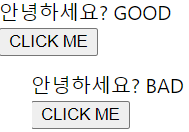

## Context API를 사용한 전역 값 관리

```js
// ContextSample.js

const { createContext, useContext } = require('react');

import React, { createContext, useContext } from 'react';

function Child({ text }) {
  return <div> 안녕하세요? {text} </div>;
}

function Parent({ text }) {
  return <Child text={text} />;
}

function GrandParent({ text }) {
  return <Parent text={text} />;
}

function ContextSample() {
  return <GrandParent text="good" />;
}

export default ContextSample;
    
// 결과: 안녕하세요? good
```

- 현재 컴포넌트의 구조가 text가 ContextSample()부터 시작해서 Child()까지 넘어가서 보여진다.
- 하지만 Context API를 사용해서 ContextSample()에서 Child()로 바로 넘겨보자.

```js
// ContextSample.js

import React, { createContext, useContext } from 'react';

const MyContext = createContext('defaultValue');
// context를 만들때는 createContext()함수를 쓰고, parameter는 기본값이다.
// 기본값은 provider라는 컴포넌트가 사용되지 않았을 때 사용된다.

function Child() {
  const text = useContext(MyContext);
  return <div> 안녕하세요? {text} </div>;
}

function Parent() {
  return <Child />;
}

function GrandParent() {
  return <Parent />;
}

function ContextSample() {
  return (
    <MyContext.Provider value="GOOD">
      <GrandParent />
    </MyContext.Provider>
  );
}

export default ContextSample;
    
    // 결과 : 안녕하세요? GOOD
```

- MyContext.Provider를 통해서 value값을 설정해주면 상단에 있는 MyContext에 값이 설정이 되고, Child() 컴포넌트에서 useContext를 사용해서 text값을 사용하는 것이다.
- MyContext 같은 context는 다른 파일에서도 작성할 수 있고,  다른 파일에서 작성한 것을 내보내고 불러와서 어디서든지 사용할 수 있다는 장점이 있다.

- MyContext.provider 에서 context값은 유동적으로 변경이 가능하다.

```js
// ContextSample.js

import React, { createContext, useContext, useState } from 'react';

const MyContext = createContext('defaultValue');

function Child() {
  const text = useContext(MyContext);
  return <div> 안녕하세요? {text} </div>;
}

function Parent() {
  return <Child />;
}

function GrandParent() {
  return <Parent />;
}

function ContextSample() {
  const [value, setValue] = useState(true);
  return (
    <MyContext.Provider value={value ? 'GOOD' : 'BAD'}>
      <GrandParent />
      <button onClick={() => setValue(!value)}>CLICK ME</button>
    </MyContext.Provider>
  );
}

export default ContextSample;
```



- 이런식으로 버튼을 클릭할 때마다 값이 바뀌게도 설정 가능하다.


## 실습

```js
// App.js

function App() {
  .
  .
  .
  ;
  
  
  const onToggle = useCallback(id => {
    dispatch({
      type: 'TOGGLE_USER',
      id
    });
  }, []);

  const onRemove = useCallback(id => {
    dispatch({
      type: 'REMOVE_USER',
      id
    });
  }, []);

  const count = useMemo(() => countActiveUsers(users), [users])

  return (
    <>
      <CreateUser
        username={username}
        email={email}
        onChange={onChange}
        onCreate={onCreate}
      />
      <UserList users={users}
        onToggle={onToggle}
        onRemove={onRemove} />
      <div>활성 사용자 수: {count} </div>
    </>

  );
}

export default App;
```

- 상단에 onToggle과 onRemove 함수를 User컴포넌트에게 주기 위해서 UserList컴포넌트를 거쳐서 주는데, 이를 고쳐보자.
- 방법은 context를 통해서 onToggle과 onRemove를 직접 넣어줄 수도 있지만, 그 대신에 dispatch만 따로 넣어서 작성해보자.

```js
// App.js

import React, { useRef, useReducer, useMemo, useCallback, createContext } from 'react';
import CreateUser from './CreateUser';
import UserList from './UserList';
import useInputs from './useInputs';

function countActiveUsers(users) {
  //
  console.log('활성 사용자 수를 세는중...')
  return users.filter(user => user.active).length;
}

const initialState = {
  users:
    [{
      id: 1,
      username: 'HJ',
      email: 'hyukjin4976@naver.com',
      active: true,
    },
    {
      id: 2,
      username: 'Steve',
      email: 'stevej0717@gmail.com',
      active: false,
    },
    {
      id: 3,
      username: 'HyukJin',
      email: 'wjdgurwls3784@hanmail.com',
      active: false,
    }],
}

function reducer(state, action) {
  switch (action.type) {
    case 'CREATE_USER':
      return {
        inputs: initialState.inputs,
        users: state.users.concat(action.user)
      }
    case 'TOGGLE_USER':
      return {
        ...state,
        users: state.users.map(user =>
          user.id === action.id
            ? { ...user, active: !user.active }
            : user)
      }
    case 'REMOVE_USER':
      return {
        ...state,
        users: state.users.filter(user => user.id !== action.id)
      }

    default:
      throw new Error('Unhandled action');
  }
}

export const UserDispatch = createContext(null);


function App() {
  //
  const [state, dispatch] = useReducer(reducer, initialState);
  const [form, onChange, reset] = useInputs({
    username: '',
    email: '',
  });
  const { username, email } = form;
  const nextId = useRef(4);
  const { users } = state;

  const onCreate = useCallback(() => {
    dispatch({
      type: 'CREATE_USER',
      user: {
        id: nextId.current,
        username,
        email,
      }
    })
    nextId.current += 1;
    reset();
  }, [username, email, reset]);

  const onToggle = useCallback(id => {
    dispatch({
      type: 'TOGGLE_USER',
      id
    });
  }, []);

  const onRemove = useCallback(id => {
    dispatch({
      type: 'REMOVE_USER',
      id
    });
  }, []);

  const count = useMemo(() => countActiveUsers(users), [users])

  return (
    <UserDispatch.Provider value={dispatch}>
      <CreateUser
        username={username}
        email={email}
        onChange={onChange}
        onCreate={onCreate}
      />
      <UserList users={users}
        onToggle={onToggle}
        onRemove={onRemove} />
      <div>활성 사용자 수: {count} </div>
    </UserDispatch.Provider>

  );
}

export default App;

```

- UserDispatch라는 context를 만들고, 기본값은 필요 없으니 null로 설정.
- context의 값은 useReducer에서 받아온 dispatch를 value로 넣어준 상태이다.

- 이제 UserList파일을 열어서 User컴포넌트에서 바로 onRemove와 onToggle를 사용하는 방법을 알아보자.

```js
// APP.js

import React, { useRef, useReducer, useMemo, useCallback, createContext } from 'react';
import CreateUser from './CreateUser';
import UserList from './UserList';
import useInputs from './useInputs';

function countActiveUsers(users) {
  //
  console.log('활성 사용자 수를 세는중...')
  return users.filter(user => user.active).length;
}

const initialState = {
  users:
    [{
      id: 1,
      username: 'HJ',
      email: 'hyukjin4976@naver.com',
      active: true,
    },
    {
      id: 2,
      username: 'Steve',
      email: 'stevej0717@gmail.com',
      active: false,
    },
    {
      id: 3,
      username: 'HyukJin',
      email: 'wjdgurwls3784@hanmail.com',
      active: false,
    }],
}

function reducer(state, action) {
  switch (action.type) {
    case 'CREATE_USER':
      return {
        inputs: initialState.inputs,
        users: state.users.concat(action.user)
      }
    case 'TOGGLE_USER':
      return {
        ...state,
        users: state.users.map(user =>
          user.id === action.id
            ? { ...user, active: !user.active }
            : user)
      }
    case 'REMOVE_USER':
      return {
        ...state,
        users: state.users.filter(user => user.id !== action.id)
      }

    default:
      throw new Error('Unhandled action');
  }
}

export const UserDispatch = createContext(null);


function App() {
  //
  const [state, dispatch] = useReducer(reducer, initialState);
  const [form, onChange, reset] = useInputs({
    username: '',
    email: '',
  });
  const { username, email } = form;
  const nextId = useRef(4);
  const { users } = state;

  const onCreate = useCallback(() => {
    dispatch({
      type: 'CREATE_USER',
      user: {
        id: nextId.current,
        username,
        email,
      }
    })
    nextId.current += 1;
    reset();
  }, [username, email, reset]);

  const count = useMemo(() => countActiveUsers(users), [users])

  return (
    <UserDispatch.Provider value={dispatch}>
      <CreateUser
        username={username}
        email={email}
        onChange={onChange}
        onCreate={onCreate}
      />
      <UserList users={users} />
      <div>활성 사용자 수: {count} </div>
    </UserDispatch.Provider>

  );
}

export default App;

```


```js
// UserList.js

import React, { useContext } from 'react';
import App from './App';
// useContext는 context를 컴포넌트 내부에서 바로 조회할 수 있게 해주는 hook.
import { UserDispatch } from './App';

const User = React.memo(function User({ user }) {
  const { username, email, id, active } = user;
  const dispatch = useContext(UserDispatch);

  return (
    <div>
      <b
        style={{
          color: active ? 'green' : 'black',
          cursor: 'pointer',
        }}
        onClick={() =>
          dispatch({
            type: 'TOGGLE_USER',
            id,
          })
        }
      >
        {username}
      </b>
      &nbsp;
      <span>({email})</span>
      <button
        onClick={() =>
          dispatch({
            type: 'REMOVE_USER',
            id,
          })
        }
      >
        삭제
      </button>
    </div>
  );
});

function UserList({ users }) {
  //
  return (
    <div>
      {users.map((user) => (
        <User user={user} key={user.id} />
      ))}
    </div>
  );
}

export default React.memo(
  UserList,
  (prevProps, nextProps) => nextProps.users === prevProps.users
);

```


