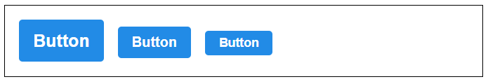
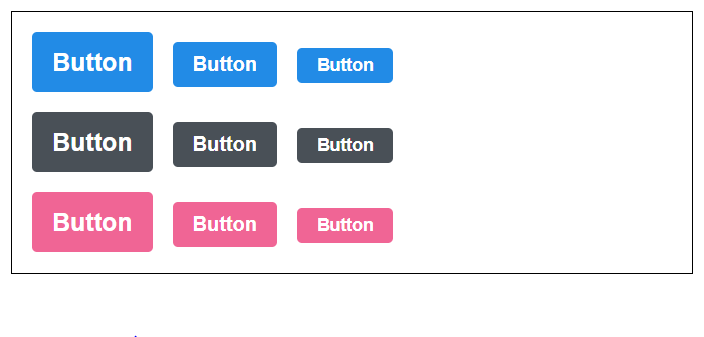
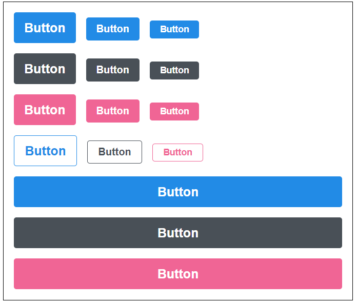

## 1. Button A - size props 설정하기

```js
// App.js

import React from 'react';
import Button from './components/Button';
import './App.scss';

function App() {
  return (
    <div className="App">
      <div className="buttons">
        <Button size="large">Button</Button>
        <Button size="medium">Button</Button>
        <Button size="small">Button</Button>
      </div>
    </div>
  );
}

export default App;
```

```js
// Button.js

import React from 'react';
import './Button.scss';
import classNames from 'classnames';

// size: large, medium, small
function Button({ children, size }) {
  // 아래 세가지 방법의 결과물은 같다.
  // return <button className={['Button', size].join('')}> {children} </button>;
  // return <button className={`Button ${size}`}> {children} </button>;
  return <button className={classNames('Button', size)}> {children} </button>;
}

Button.defaultProps = {
  size: 'meidum',
};

export default Button;

```

```scss
// Button.scss

// 변수를 사용할 때는 $표시를 사용한다.
$blue: #228be6;

.Button {
  color: white;
  font-weight: bold;
  outline: none;
  border: none;
  border-radius: 4px;
  cursor: pointer;
  padding-left: 1rem;
  padding-right: 1rem;

  &.large {
    height: 3rem;
    font-size: 1.25rem;
  }

  &.medium {
    height: 2.25rem;
    font-size: 1rem;
  }

  &.small {
    height: 1.75rem;
    font-size: 0.875rem;
  }

  background: $blue;
  &:hover {
    // &는 자기 자신을 가리킨다.
    background: lighten($blue, 10%);
  }
  &:active {
    background: darken($blue, 10%);
  }
}

.Button + Button {
  // & + & {...}로 사용해도 똑같이 작동한다.
  //오른쪽 버튼에 특정 스타일을 넣겠다.
  margin-left: 1rem;
}

```



---

---


## 2. Button B - color props 설정하기

```js
// App.js

import React from 'react';
import Button from './components/Button';
import './App.scss';

function App() {
  return (
    <div className="App">
      <div className="buttons">
        <Button size="large"> Button </Button>
        <Button> Button </Button>
        <Button size="small"> Button </Button>
      </div>
      <div className="buttons">
        <Button color="gray" size="large">
          Button
        </Button>
        <Button color="gray"> Button </Button>
        <Button color="gray" size="small">
          Button
        </Button>
      </div>
      <div className="buttons">
        <Button color="pink" size="large">
          Button
        </Button>
        <Button color="pink"> Button </Button>
        <Button color="pink" size="small">
          Button
        </Button>
      </div>
    </div>
  );
}

export default App;

```

```scss
.App {
  width: 512px;
  margin: 0 auto;
  margin-top: 4rem;
  border: 1px solid black;
  padding: 1rem;
  .buttons + .buttons {
    margin-top: 1rem;
  }
}

```


```js
// Button.js

import React from 'react';
import './Button.scss';
import classNames from 'classnames';

// size: large, medium, small
function Button({ children, size, color }) {
  // 아래 세가지 방법의 결과물은 같다.
  // return <button className={['Button', size].join('')}> {children} </button>;
  // return <button className={`Button ${size}`}> {children} </button>;
  return (
    <button className={classNames('Button', size, color)}> {children} </button>
  );
}

Button.defaultProps = {
  size: 'medium',
  color: 'blue',
};

export default Button;
```

```scss
// Button.scss

// 변수를 사용할 때는 $표시를 사용한다.
$blue: #228be6;
$gray: #495057;
$pink: #f06595;

@mixin button-color($color) {
  // 반복되는 코드가 있다면 scss의 mixin코드를 사용하면 편리하다.
  background: $color;
  &:hover {
    background: lighten($color, 10%);
  }
  &:active {
    background: darken($color, 10%);
  }
}

.Button {
  color: white;
  font-weight: bold;
  outline: none;
  border: none;
  border-radius: 4px;
  cursor: pointer;
  padding-left: 1rem;
  padding-right: 1rem;

  &.large {
    height: 3rem;
    font-size: 1.25rem;
  }

  &.medium {
    height: 2.25rem;
    font-size: 1rem;
  }

  &.small {
    height: 1.75rem;
    font-size: 0.875rem;
  }

  &.blue {
    @include button-color($blue);
  }

  &.gray {
    @include button-color($gray);
  }

  &.pink {
    @include button-color($pink);
  }

  & + & {
    margin-left: 1rem;
  }
}
```



---

---


## 3. Button C - outline.fullwidth props 설정하기

```js
// App.js

import React from 'react';
import Button from './components/Button';
import './App.scss';

function App() {
  return (
    <div className="App">
      <div className="buttons">
        <Button size="large"> Button </Button>
        <Button> Button </Button>
        <Button size="small"> Button </Button>
      </div>
      <div className="buttons">
        <Button color="gray" size="large">
          Button
        </Button>
        <Button color="gray"> Button </Button>
        <Button color="gray" size="small">
          Button
        </Button>
      </div>
      <div className="buttons">
        <Button color="pink" size="large">
          Button
        </Button>
        <Button color="pink"> Button </Button>
        <Button color="pink" size="small">
          Button
        </Button>
      </div>
      <div className="buttons">
        <Button size="large" outline={true}>
          Button
        </Button>
        <Button color="gray" outline>
          Button
        </Button>
        <Button color="pink" size="small" outline>
          Button
        </Button>
      </div>
      <div className="buttons">
        <Button size="large" fullWidth={true}>
          Button
        </Button>
        <Button size="large" color="gray" fullWidth>
          Button
        </Button>
        <Button size="large" color="pink" fullWidth>
          Button
        </Button>
      </div>
    </div>
  );
}

export default App;

```

```js
// Button.js

import React from 'react';
import './Button.scss';
import classNames from 'classnames';

function Button({ children, size, color, outline, fullWidth }) {
  return (
    <button
      className={classNames('Button', size, color, { outline, fullWidth })}
      // props로받아온 outline과 fullWidth값이 트루일 때만, 전체 클래스네임에 포함된다.
      // 즉, 값이 트루일때만 적용된다.
    >
      {children}
    </button>
  );
}

Button.defaultProps = {
  size: 'medium',
  color: 'blue',
};

export default Button;

```

```scss
// Button.scss

// 변수를 사용할 때는 $표시를 사용한다.
$blue: #228be6;
$gray: #495057;
$pink: #f06595;

@mixin button-color($color) {
  // 반복되는 코드가 있다면 scss의 mixin코드를 사용하면 편리하다.
  background: $color;
  &:hover {
    background: lighten($color, 10%);
  }
  &:active {
    background: darken($color, 10%);
  }

  &.outline {
    color: $color;
    background: none;
    border: 1px solid $color;
    &:hover {
      background: $color;
      color: white;
    }
  }
}

.Button {
  color: white;
  font-weight: bold;
  outline: none;
  border: none;
  border-radius: 4px;
  cursor: pointer;
  padding-left: 1rem;
  padding-right: 1rem;

  &.large {
    height: 3rem;
    font-size: 1.25rem;
  }

  &.medium {
    height: 2.25rem;
    font-size: 1rem;
  }

  &.small {
    height: 1.75rem;
    font-size: 0.875rem;
  }

  &.blue {
    @include button-color($blue);
  }

  &.gray {
    @include button-color($gray);
  }

  &.pink {
    @include button-color($pink);
  }

  & + & {
    margin-left: 1rem;
  }

  &.fullWidth {
    width: 100%;
    justify-content: center;
    & + & {
      margin-left: 0;
      margin-top: 1rem;
    }
  }
}

```




---

---


## 4. Button D - ...rest props 전달하기

```js
// App.js

import React from 'react';
import Button from './components/Button';
import './App.scss';

function App() {
  return (
    <div className="App">
      <div className="buttons">
        <Button size="large"> Button </Button>
        <Button> Button </Button>
        <Button size="small"> Button </Button>
      </div>
      <div className="buttons">
        <Button color="gray" size="large">
          Button
        </Button>
        <Button color="gray"> Button </Button>
        <Button color="gray" size="small">
          Button
        </Button>
      </div>
      <div className="buttons">
        <Button color="pink" size="large">
          Button
        </Button>
        <Button color="pink"> Button </Button>
        <Button color="pink" size="small">
          Button
        </Button>
      </div>
      <div className="buttons">
        <Button size="large" outline={true}>
          Button
        </Button>
        <Button color="gray" outline>
          Button
        </Button>
        <Button color="pink" size="small" outline>
          Button
        </Button>
      </div>
      <div className="buttons">
        <Button size="large" fullWidth={true}>
          Button
        </Button>
        <Button size="large" color="gray" fullWidth>
          Button
        </Button>
        <Button
          size="large"
          color="pink"
          fullWidth
          onClick={() => {
            console.log('click!');
          }}
          onMouseMove={() => {
            console.log('Mouse Move!');
          }}
          // onClick, onMouseMove 추가
        >
          Button
        </Button>
      </div>
    </div>
  );
}

export default App;

```

```js
// Button.js

import React from 'react';
import './Button.scss';
import classNames from 'classnames';

function Button({
  children,
  size,
  color,
  outline,
  fullWidth,
  onClick,
  onMouseMove,
  // onClick, onMouseMove 
}) {
  return (
    <button
      className={classNames('Button', size, color, { outline, fullWidth })}
      onClick={onClick}
      onMouseMove={onMouseMove}
	  // onClick, onMouseMove 추가
    >
      {children}
    </button>
  );
}

Button.defaultProps = {
  size: 'medium',
  color: 'blue',
};

export default Button;

```

- 모든 이벤트에 대해서 이런식으로 추가하면 너무 코드가 길어지고 유지보수가 힘들다.
- 그래서 ...rest를 사용한다.

```js
// Button.js
import React from 'react';
import './Button.scss';
import classNames from 'classnames';

function Button({
  children,
  size,
  color,
  outline,
  fullWidth,
  ...rest
}) {
  return (
    <button
      className={classNames(
        'Button',
        size,
        color,
        {
          outline,
          fullWidth,
        }
      )}
      {...rest}
    >
      {children}
    </button>
  );
}

Button.defaultProps = {
  size: 'medium',
  color: 'blue',
};

export default Button;
```


- 이번에는 Button.js에서 className을 추가해서 받아오고, App.js에서 사용해보자.

```js
// App.js

import React from 'react';
import Button from './components/Button';
import './App.scss';

function App() {
  return (
    <div className="App">
      <div className="buttons">
        <Button size="large"> Button </Button>
        <Button> Button </Button>
        <Button size="small"> Button </Button>
      </div>
      <div className="buttons">
        <Button color="gray" size="large">
          Button
        </Button>
        <Button color="gray"> Button </Button>
        <Button color="gray" size="small">
          Button
        </Button>
      </div>
      <div className="buttons">
        <Button color="pink" size="large">
          Button
        </Button>
        <Button color="pink"> Button </Button>
        <Button color="pink" size="small">
          Button
        </Button>
      </div>
      <div className="buttons">
        <Button size="large" outline={true}>
          Button
        </Button>
        <Button color="gray" outline>
          Button
        </Button>
        <Button color="pink" size="small" outline>
          Button
        </Button>
      </div>
      <div className="buttons">
        <Button size="large" fullWidth={true} className="customized-button">
          {/* className으로 따로 설정해주고, App.scss에서 스타일을 추가하면 된다. */}
          Button
        </Button>
        <Button size="large" color="gray" fullWidth>
          Button
        </Button>
        <Button
          size="large"
          color="pink"
          fullWidth
          onClick={() => {
            console.log('click!');
          }}
          onMouseMove={() => {
            console.log('Mouse Move!');
          }}
        >
          Button
        </Button>
      </div>
    </div>
  );
}

export default App;
```

```js
// Button.js

import React from 'react';
import './Button.scss';
import classNames from 'classnames';

function Button({
  children,
  size,
  color,
  outline,
  fullWidth,
  className,
  ...rest
}) {
  return (
    <button
      className={classNames(
        'Button', 
        size,
        color,
        {
          outline,
          fullWidth,
        },
        className
        // 이런식으로 className도 받아와서 사용할 수 있다.
        // 이렇게 쓰면 App.js에서 className을 추가할 수 있다.
      )}
      {...rest}
    >
      {children}
    </button>
  );
}

Button.defaultProps = {
  size: 'medium',
  color: 'blue',
};

export default Button;
```

```scss
// Button.scss

.App {
  width: 512px;
  margin: 0 auto;
  margin-top: 4rem;
  border: 1px solid black;
  padding: 1rem;
  .buttons + .buttons {
    margin-top: 1rem;
  }
  .customized-button {
    background: black;
  }
}
```

---

---


## 5. className이 겹치지 않게 작성하는 팁

1. 컴포넌트의 이름을 고유하게 지정한다. 
   - ex) UserProfile이라는 컴포넌트를 만들었으면, 다른 디렉토리에서는 이 이름을 사용하지 않는다.
2. 최상위 엘리먼트의 클래스이름을 컴포넌트 이름과 똑같게 작성한다.
   - ex) 컴포넌트처럼 맨 앞을 대문자로 시작.
3. 그 내부에서 CSS셀렉터를 사용하자.

```css
.UserProfile{
    /* 최상위는 컴포넌트의 이름과 똑같이.*/
    .user {
        img{
            
        }
        .username{
            
        }
    }
    .about {
        
    }
}
```

- 이런식으로 사용하면 CSS class이름이 중복되는 경우를 줄일 수 있다.