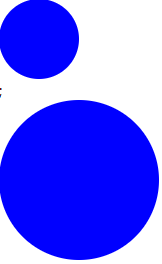
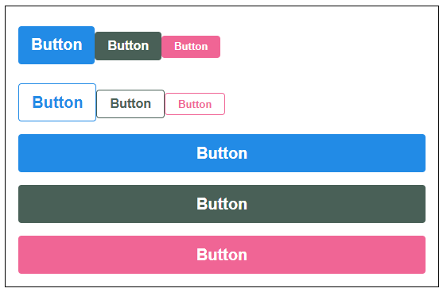
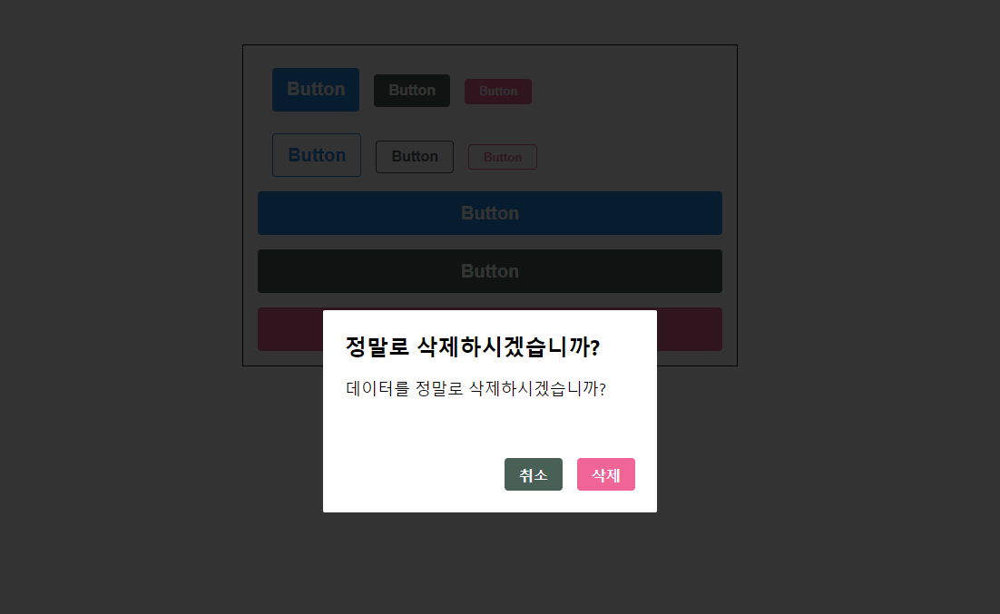

# CSS in JS (자바스크립트 안에 CSS내용을 적는 것)

> Styled-components는 관련 가장 인기있는 라이브러리이다. 그렇다고 무조건 가장 좋은 것은 아니다!
>
> 이외에도 emotion, styled-jsx, jss 등이 있다. 사용방법은 다르다.

> Styled-components는 "Tagged Template Literal"을 사용한다. (Template Literal과 비슷하다.)

```js
import React from 'react';
import Circle = styled.div`
	width: 5rem;
	height: 5rem;
`;

function App() {
    return <Circle />;
}

export default App;
```

---

#### 사용방법:

```bash
yarn add styled-components
```

- 사용할 파일 디렉토리에서 라이브러리 설치 후 사용해야 한다.

---

```js
// App.js

import React from 'react';
import styled from 'styled-components';

const Circle = styled.div`
  width: 5rem;
  height: 5rem;
  background: black;
  border-radius: 50%;
`;

function App() {
  return <Circle />
}

export default App;
```


- props를 이용해서 사용해보자!

```js
// App.js

import React from 'react';
import styled from 'styled-components';

const Circle = styled.div`
  width: 5rem;
  height: 5rem;
  background: ${props => props.color};
  border-radius: 50%;
  ${props => props.huge && `width:10rem; height:10rem`}
`;

function App() {
  return (
    <>
      <Circle color="blue" />;
      <Circle color="blue" huge />;
    </>
  )
}

export default App;
```



- 하지만 이렇게 사용하면 단점이 있다.

```js
// App.js

const Circle = styled.div`
  width: 5rem;
  height: 5rem;
  background: ${props => props.color};
  border-radius: 50%;
  ${props => props.huge && `width:10rem; height:10rem`}
	// 이 내부에서 ${props} 이렇게 다른 props를 읽어올 수 없다. (그냥 template literal이기 때문)
`;
```

- Tagged Template Literal을 사용하려면 아래와 같이 작성해야한다.

```js
// App.js

import React from 'react';
import styled, { css } from 'styled-components';
// css를 불러와서

const Circle = styled.div`
  width: 5rem;
  height: 5rem;
  background: ${props => props.color};
  border-radius: 50%;
  ${props => props.huge &&
    css`
    ${props}
    width:10rem; 
    height:10rem
    `}
`;
// 이렇게 사용해야 한다.

function App() {
  return (
    <>
      <Circle color="blue" />;
      <Circle color="blue" huge />;
    </>
  )
}

export default App;
```

---

---


## styled-components로 재사용성 높은 버튼을 만들어보자.

```js
// App.js

import React from 'react';
import styled from 'styled-components';
import Button from './components/Button';

const AppBlock = styled.div`
  width: 512px;
  margin: 0 auto;
  margin-top:4rem;
  border: 1px solid black;
  padding: 1rem;
`;

function App() {
  return (
    <AppBlock>
      <Button>Button</Button>
    </AppBlock>
  )
}

export default App;
```

```js
// Button.js

import React from 'react';
import styled from 'styled-components';

const StyledButton = styled.button`
  /* 공통 스타일  */
  display: flex;
  align-items: center;
  outline: none;
  border: none;
  border-radius: 4px;
  color: white;
  font-weight: bold;
  cursor: pointer;
  padding-left: 1rem;
  padding-right: 1rem;

  /* 크기 */
  height: 2.25rem;
  font-size: 1rem;

  /* 색상 */
  background: #228be6;
  &:hover {
    background: #339af0;
  }
  &:active {
    background: #1c7ed6;
  }

  /* 기타 */
  & + & {
    margin-left: 1rem;
  }
`;

function Button({ children, ...rest }) {
  return <StyledButton {...rest}>{children}</StyledButton>;
}

export default Button;
```


## 다양한 색상을 입혀보자.

- 우선, Polished라는 다양한 스타일이 있는 유틸 함수 라이브러리를 설치해보자.
  - https://polished.js.org/docs/ ( 설치방법 및 사용법 )

```js
// Button.js

import React from 'react';
import styled from 'styled-components';
import { darken, lighten } from 'polished';

const StyledButton = styled.button`
  /* 공통 스타일  */
  display: flex;
  align-items: center;
  outline: none;
  border: none;
  border-radius: 4px;
  color: white;
  font-weight: bold;
  cursor: pointer;
  padding-left: 1rem;
  padding-right: 1rem;

  /* 크기 */
  height: 2.25rem;
  font-size: 1rem;

  /* 색상 */
  background: #228be6;
  &:hover {
    background: ${lighten(0.1, `#228be6`)};
  }
  &:active {
    background: ${darken(0.1, `#228be6`)};
  }

  /* 기타 */
  & + & {
    margin-left: 1rem;
  }
`;

function Button({ children, ...rest }) {
  return <StyledButton {...rest}>{children}</StyledButton>;
}

export default Button;

```


- ThemeProvider를 사용하면 어떤 styled-components던지 쉽게 조회해서 사용할 수 있다. 

```js
// App.js

import React from 'react';
import styled, { ThemeProvider } from 'styled-components';
import Button from './components/Button';

const AppBlock = styled.div`
  width: 512px;
  margin: 0 auto;
  margin-top:4rem;
  border: 1px solid black;
  padding: 1rem;
`;

const palette = {
  blue: '#228be6',
  gray: '#496057',
  pink: '#f06595'
}

function App() {
  return (
    <ThemeProvider theme={{ palette }}>
      {/* ThemeProvider로 감싸주고 theme이라는 객체를 설정해주면 된다. */}
      <AppBlock>
        <Button>Button</Button>
      </AppBlock>
    </ThemeProvider>
  )
}

export default App;
```

- App.js에서 선언하고 Button.js에서 가져와 사용한다.

```js
// Button.js

import React from 'react';
import styled from 'styled-components';
import { darken, lighten } from 'polished';

const StyledButton = styled.button`
  /* 공통 스타일  */
  display: flex;
  align-items: center;
  outline: none;
  border: none;
  border-radius: 4px;
  color: white;
  font-weight: bold;
  cursor: pointer;
  padding-left: 1rem;
  padding-right: 1rem;

  /* 크기 */
  height: 2.25rem;
  font-size: 1rem;

  /* 색상 */
  background: ${(props) => props.theme.palette.blue};
  &:hover {
    background: ${(props) => lighten(0.1, props.theme.palette.blue)};
  }
  &:active {
    background: ${(props) => darken(0.1, props.theme.palette.blue)};
  }

  /* 기타 */
  & + & {
    margin-left: 1rem;
  }
`;

function Button({ children, ...rest }) {
  return <StyledButton {...rest}>{children}</StyledButton>;
}

export default Button;

```

- 위 코드에서 props.theme.palette.를 여러번 사용하는 대신에 스타일 코드를 하나의 함수 안에다가 묶어서 넣고 사용해보자.
- css 선언이 필요하다

```js
// Button.js

import React from 'react';
import styled, { css } from 'styled-components';
import { darken, lighten } from 'polished';

const StyledButton = styled.button`
  /* 공통 스타일  */
  display: flex;
  align-items: center;
  outline: none;
  border: none;
  border-radius: 4px;
  color: white;
  font-weight: bold;
  cursor: pointer;
  padding-left: 1rem;
  padding-right: 1rem;

  /* 크기 */
  height: 2.25rem;
  font-size: 1rem;

  /* 색상 */
  ${(props) => {
    const color = props.theme.palette.blue;
    return css`
      background: ${color};
      &:hover {
        background: ${lighten(0.1, color)};
      }
      &:active {
        background: ${darken(0.1, color)};
      }
    `;
  }}

  /* 기타 */
  & + & {
    margin-left: 1rem;
  }
`;

function Button({ children, ...rest }) {
  return <StyledButton {...rest}>{children}</StyledButton>;
}

export default Button;

```

- 위 코드로 다른 여러 색상의 버튼을 만들 때 코드를 어떻게 사용하면 되는지 확인해보자.

```js
// App.js

.
.
.;
function App() {
  return (
    <ThemeProvider theme={{ palette }}>
      {/* ThemeProvider로 감싸주고 theme이라는 객체를 설정해주면 된다. */}
      <AppBlock>
        <Button>Button</Button>
        <Button color="gray">Button</Button>
        <Button color="pink">Button</Button>
      </AppBlock>
    </ThemeProvider>
  )
}
```

- 버튼을 추가하고 색상을 넣어보자.

```js
// Button.js

import React from 'react';
import styled, { css } from 'styled-components';
import { darken, lighten } from 'polished';

const StyledButton = styled.button`
  /* 공통 스타일  */
  display: flex;
  align-items: center;
  outline: none;
  border: none;
  border-radius: 4px;
  color: white;
  font-weight: bold;
  cursor: pointer;
  padding-left: 1rem;
  padding-right: 1rem;

  /* 크기 */
  height: 2.25rem;
  font-size: 1rem;

  /* 색상 */
  ${(props) => {
    // const color = props.theme.palette.blue;
    const color = props.theme.palette[props.color];
    return css`
      background: ${color};
      &:hover {
        background: ${lighten(0.1, color)};
      }
      &:active {
        background: ${darken(0.1, color)};
      }
    `;
  }}

  /* 기타 */
  & + & {
    margin-left: 1rem;
  }
`;

function Button({ children, color, ...rest }) {
  return (
    <StyledButton color={color} {...rest}>
      {/* color가 rest안에 들어가기 때문에 color={color}는 생략해도 되지만 */}
      {/* 어떠한 props들이 따로 들어가는지 명시하면 좋기 때문에 따로 명시한다 */}
      {children}
    </StyledButton>
  );
}

Button.defaultProps = {
  color: 'blue',
};

export default Button;

```


- 이제 위 코드를 리팩토링 해보자

```js
// Button.js

import React from 'react';
import styled, { css } from 'styled-components';
import { darken, lighten } from 'polished';

const colorStyles = css`
  /* 색상 */
  ${({ theme, color }) => {
    const selected = theme.palette[color];
    return css`
      background: ${selected};
      &:hover {
        background: ${lighten(0.1, color)};
      }
      &:active {
        background: ${darken(0.1, color)};
      }
    `;
  }}
`;

const StyledButton = styled.button`
  /* 공통 스타일  */
  display: inline-flex;
  align-items: center;
  outline: none;
  border: none;
  border-radius: 4px;
  color: white;
  font-weight: bold;
  cursor: pointer;
  padding-left: 1rem;
  padding-right: 1rem;

  /* 크기 */
  height: 2.25rem;
  font-size: 1rem;

  ${colorStyles}

  /* 기타 */
  & + & {
    margin-left: 1rem;
  }
`;

function Button({ children, color, ...rest }) {
  return (
    <StyledButton color={color} {...rest}>
      {/* color가 rest안에 들어가기 때문에 color={color}는 생략해도 되지만 */}
      {/* 어떠한 props들이 따로 들어가는지 명시하면 좋기 때문에 따로 명시한다 */}
      {children}
    </StyledButton>
  );
}

Button.defaultProps = {
  color: 'blue',
};

export default Button;

```

---

---


## 이번에는 버튼에 다양한 사이즈를 적용해보자.

```js
// Button.js

import React from 'react';
import styled, { css } from 'styled-components';
import { darken, lighten } from 'polished';

const colorStyles = css`
  /* 색상 */
  ${({ theme, color }) => {
    const selected = theme.palette[color];
    return css`
      background: ${selected};
      &:hover {
        background: ${lighten(0.1, color)};
      }
      &:active {
        background: ${darken(0.1, color)};
      }
    `;
  }}
`;

const sizeStyles = css`
  /* 크기 */
  ${(props) =>
    props.size === 'large' &&
    css`
      height: 3rem;
      font-size: 1.25rem;
    `}

  ${(props) =>
    props.size === 'medium' &&
    css`
      height: 2.25rem;
      font-size: 1;
    `}

  ${(props) =>
    props.size === 'small' &&
    css`
      height: 1.75rem;
      font-size: 0.875rem;
    `};
`;

const StyledButton = styled.button`
  /* 공통 스타일  */
  display: inline-flex;
  align-items: center;
  outline: none;
  border: none;
  border-radius: 4px;
  color: white;
  font-weight: bold;
  cursor: pointer;
  padding-left: 1rem;
  padding-right: 1rem;

  ${colorStyles}
  ${sizeStyles}

  /* 기타 */
  & + & {
    margin-left: 1rem;
  }
`;

function Button({ children, color, size, ...rest }) {
  return (
    <StyledButton color={color} size={size} {...rest}>
      {children}
    </StyledButton>
  );
}

Button.defaultProps = {
  color: 'blue',
  size: 'medium',
};

export default Button;

```

```js
// App.js

import React from 'react';
import styled, { ThemeProvider } from 'styled-components';
import Button from './components/Button';

const AppBlock = styled.div`
  width: 512px;
  margin: 0 auto;
  margin-top:4rem;
  border: 1px solid black;
  padding: 1rem;
`;

const ButtonGroup = styled.div`
  & + & {
    margin-top: 1rem;
  }
`;

const palette = {
  blue: '#228be6',
  gray: '#496057',
  pink: '#f06595'
}

function App() {
  return (
    <ThemeProvider theme={{ palette }}>
      <AppBlock>
        <ButtonGroup>
          <Button size="large">Button</Button>
          <Button color="gray">Button</Button>
          <Button size="small" color="pink">Button</Button>
        </ButtonGroup>
      </AppBlock>
    </ThemeProvider>
  )
}

export default App;
```


- 이번에는 위에서 반복되는 코드를 리팩토링 해보자.


```js
// Button.js

import React from 'react';
import styled, { css } from 'styled-components';
import { darken, lighten } from 'polished';

const colorStyles = css`
  /* 색상 */
  ${({ theme, color }) => {
    const selected = theme.palette[color];
    return css`
      background: ${selected};
      &:hover {
        background: ${lighten(0.1, color)};
      }
      &:active {
        background: ${darken(0.1, color)};
      }
    `;
  }}
`;

const sizes = {
  large: {
    height: '3rem',
    fontSize: '1.25rem',
  },
  medium: {
    height: '2.25rem',
    fontSize: '1rem',
  },
  small: {
    height: '1.75rem',
    fontSize: '0.825rem',
  },
};

const sizeStyles = css`
  /* 크기 */
  ${({ size }) => css`
    height: ${sizes[size].height};
    font-size: ${sizes[size].fontSize};
  `}
`;

const StyledButton = styled.button`
  /* 공통 스타일  */
  display: inline-flex;
  align-items: center;
  outline: none;
  border: none;
  border-radius: 4px;
  color: white;
  font-weight: bold;
  cursor: pointer;
  padding-left: 1rem;
  padding-right: 1rem;

  ${colorStyles}
  ${sizeStyles}

  /* 기타 */
  & + & {
    margin-left: 1rem;
  }
`;

function Button({ children, color, size, ...rest }) {
  return (
    <StyledButton color={color} size={size} {...rest}>
      {children}
    </StyledButton>
  );
}

Button.defaultProps = {
  color: 'blue',
  size: 'medium',
};

export default Button;
```

- 이렇게 코드를 많이 줄일 수 있다.

---

---


## 이번에는 outline, fullWidth를 설정해보자

- outline설정을 하면 테두리만 보이고 fullWidth는 자신이 차지할 수 있는 가로 넓이를 100% 차지한다.

```js
// App.js

import React from 'react';
import styled, { ThemeProvider } from 'styled-components';
import Button from './components/Button';

const AppBlock = styled.div`
  width: 512px;
  margin: 0 auto;
  margin-top:4rem;
  border: 1px solid black;
  padding: 1rem;
`;

const ButtonGroup = styled.div`
  & + & {
    margin-top: 1rem;
  }
`;

const palette = {
  blue: '#228be6',
  gray: '#496057',
  pink: '#f06595'
}

function App() {
  return (
    <ThemeProvider theme={{ palette }}>
      <AppBlock>
        <ButtonGroup>
          <Button size="large">Button</Button>
          <Button color="gray">Button</Button>
          <Button size="small" color="pink">Button</Button>
        </ButtonGroup>
        <ButtonGroup>
          <Button size="large" outline>Button</Button>
          <Button color="gray" outline>Button</Button>
          <Button size="small" color="pink" outline>Button</Button>
        </ButtonGroup>
        <ButtonGroup>
          <Button size="large" fullWidth>Button</Button>
          <Button size="large" color="gray" fullWidth>Button</Button>
          <Button size="large" color="pink" fullWidth>Button</Button>
        </ButtonGroup>
      </AppBlock>
    </ThemeProvider>
  )
}

export default App;
```


```js
// Button.js

import React from 'react';
import styled, { css } from 'styled-components';
import { darken, lighten } from 'polished';

const colorStyles = css`
  /* 색상 */
  ${({ theme, color }) => {
    const selected = theme.palette[color];
    return css`
      background: ${selected};
      &:hover {
        background: ${lighten(0.1, color)};
      }
      &:active {
        background: ${darken(0.1, color)};
      }
      ${(props) =>
        props.outline &&
        css`
          color: ${selected};
          background: none;
          border: 1px solid ${selected};
          &:hover {
            background: ${selected};
            color: white;
          }
        `}
    `;
  }}
`;

const sizes = {
  large: {
    height: '3rem',
    fontSize: '1.25rem',
  },
  medium: {
    height: '2.25rem',
    fontSize: '1rem',
  },
  small: {
    height: '1.75rem',
    fontSize: '0.825rem',
  },
};

const sizeStyles = css`
  /* 크기 */
  ${({ size }) => css`
    height: ${sizes[size].height};
    font-size: ${sizes[size].fontSize};
  `}
`;

const fullWidthStyle = css`
  ${(props) =>
    props.fullWidth &&
    css`
      width: 100%;
      justify-content: center;
      & + & {
        margin-left: 0;
        margin-top: 1rem;
      }
    `}
`;

const StyledButton = styled.button`
  /* 공통 스타일  */
  display: inline-flex;
  align-items: center;
  outline: none;
  border: none;
  border-radius: 4px;
  color: white;
  font-weight: bold;
  cursor: pointer;
  padding-left: 1rem;
  padding-right: 1rem;

  /* 기타 */
  & + & {
    margin-left: 1rem;
  }

  ${colorStyles}
  ${sizeStyles}
  ${fullWidthStyle}
`;

function Button({ children, color, size, outline, fullWidth, ...rest }) {
  return (
    <StyledButton
      color={color}
      size={size}
      outline={outline}
      fullWidth={fullWidth}
      {...rest}
    >
      {children}
    </StyledButton>
  );
}

Button.defaultProps = {
  color: 'blue',
  size: 'medium',
};

export default Button;

```



---

---


## Dialog를 구현해보자

```js
// App.js
.
.
.;
function App() {
  return (
    <ThemeProvider theme={{ palette }}>
      <AppBlock>
        <ButtonGroup>
          <Button size="large">Button</Button>
          <Button color="gray">Button</Button>
          <Button size="small" color="pink">Button</Button>
        </ButtonGroup>
        <ButtonGroup>
          <Button size="large" outline>Button</Button>
          <Button color="gray" outline>Button</Button>
          <Button size="small" color="pink" outline>Button</Button>
        </ButtonGroup>
        <ButtonGroup>
          <Button size="large" fullWidth>Button</Button>
          <Button size="large" color="gray" fullWidth>Button</Button>
          <Button size="large" color="pink" fullWidth>Button</Button>
        </ButtonGroup>
        <Dialog
          title="정말로 삭제하시겠습니까?"
          confirmText="삭제"
          cancelText="취소"
        >
          데이터를 정말로 삭제하시겠습니까?
        </Dialog>
      </AppBlock>
    </ThemeProvider>
  )
}

export default App;

```

```js
// Dialog.js

import React from 'react';
import styled from 'styled-components';
import Button from './Button';

const DarkBackground = styled.div`
  position: fixed;
  top: 0;
  left: 0;
  width: 100%;
  height: 100%;
  display: flex;
  align-items: center;
  justify-content: center;
  background: rgba(0, 0, 0, 0.8);
`;

const DialogBlock = styled.div`
  width: 320px;
  padding: 1.5rem;
  background: white;
  border-radius: 2px;

  h3 {
    margin: 0;
    font-size: 1.5rem;
  }

  p {
    font-size: 1.125rem;
  }
`;

const ButtonGroup = styled.div`
  margin-top: 3rem;
  display: felx;
  justify-content: flex-end;
`;

function Dialog({ title, children, confirmText, cancelText }) {
  return (
    <DarkBackground>
      <DialogBlock>
        <h3>{title}</h3>
        <p>{children}</p>
        <ButtonGroup>
          <Button color="gray"> {cancelText} </Button>
          <Button color="pink"> {confirmText} </Button>
        </ButtonGroup>
      </DialogBlock>
    </DarkBackground>
  );
}

Dialog.defaultProps = {
  cancelText: '취소',
  confirmText: '확인',
};

export default Dialog;

```



- 이제 기능을 구현해보자!

```js
// App.js

import React, { useState } from 'react';
import styled, { ThemeProvider } from 'styled-components';
import Button from './components/Button';
import Dialog from './components/Dialog';

const AppBlock = styled.div`
  width: 512px;
  margin: 0 auto;
  margin-top: 4rem;
  border: 1px solid black;
  padding: 1rem;
`;

const ButtonGroup = styled.div`
  & + & {
    margin-top: 1rem;
  }
`;

const palette = {
  blue: '#228be6',
  gray: '#496057',
  pink: '#f06595'
}

function App() {
  const [dialog, setDialog] = useState(false);
  const onClick = () => {
    setDialog(true);
  };

  const onConfirm = () => {
    console.log('확인')
    setDialog(false);
  };

  const onCancel = () => {
    console.log('취소')
    setDialog(false);
  };


  return (
    <ThemeProvider theme={{ palette }}>
      <>
        <AppBlock>
          <Button color="pink" size="large" onClick={onClick}>
            삭제
          </Button>
        </AppBlock>
        <Dialog
          title="정말로 삭제하시겠습니까?"
          confirmText="삭제"
          cancelText="취소"
          onConfirm={onConfirm}
          onCancel={onCancel}
          visible={dialog}
        >
          데이터를 정말로 삭제하시겠습니까?
      </Dialog>
      </>
    </ThemeProvider >
  )
}

export default App;
```

```js
// Dialog.js

import React from 'react';
import styled from 'styled-components';
import Button from './Button';

const DarkBackground = styled.div`
  position: fixed;
  top: 0;
  left: 0;
  width: 100%;
  height: 100%;
  display: flex;
  align-items: center;
  justify-content: center;
  background: rgba(0, 0, 0, 0.8);
`;

const DialogBlock = styled.div`
  width: 320px;
  padding: 1.5rem;
  background: white;
  border-radius: 2px;

  h3 {
    margin: 0;
    font-size: 1.5rem;
  }

  p {
    font-size: 1.125rem;
  }
`;

const ButtonGroup = styled.div`
  margin-top: 3rem;
  display: felx;
  justify-content: flex-end;
`;

const ShortMarginButton = styled(Button)`
  & + & {
    margin-left: 0.5rem;
  }
`;
// 위처럼, 만약 Dialog안에 버튼 간격을 좁히고 싶다면, 이미 버튼과 버튼사이의 스타일링이 되어 있기 때문에,
// 기존에 있던 것을 상속받아서 새로운 컴포넌트를 만들어서 사용하면 된다.

function Dialog({
  title,
  children,
  confirmText,
  cancelText,
  visible,
  onCancel,
  onConfirm,
}) {
  if (!visible) return null;

  return (
    <DarkBackground>
      <DialogBlock>
        <h3>{title}</h3>
        <p>{children}</p>
        <ButtonGroup>
          <ShortMarginButton color="gray" onClick={onCancel}>
            {cancelText}
          </ShortMarginButton>
          <ShortMarginButton color="pink" onClick={onConfirm}>
            {confirmText}
          </ShortMarginButton>
        </ButtonGroup>
      </DialogBlock>
    </DarkBackground>
  );
}

Dialog.defaultProps = {
  cancelText: '취소',
  confirmText: '확인',
};

export default Dialog;
```


---

---


## Dialog가 화면에 나타나거나 사라질 때의 transition효과를 알아보자

```js
// App.js

import React, { useState } from 'react';
import styled, { ThemeProvider } from 'styled-components';
import Button from './components/Button';
import Dialog from './components/Dialog';

const AppBlock = styled.div`
  width: 512px;
  margin: 0 auto;
  margin-top: 4rem;
  border: 1px solid black;
  padding: 1rem;
`;

const ButtonGroup = styled.div`
  & + & {
    margin-top: 1rem;
  }
`;

const palette = {
  blue: '#228be6',
  gray: '#496057',
  pink: '#f06595'
}

function App() {
  const [dialog, setDialog] = useState(false);
  const onClick = () => {
    setDialog(true);
  };

  const onConfirm = () => {
    console.log('확인')
    setDialog(false);
  };

  const onCancel = () => {
    console.log('취소')
    setDialog(false);
  };


  return (
    <ThemeProvider theme={{ palette }}>
      <>
        <AppBlock>
          <Button color="pink" size="large" onClick={onClick}>
            삭제
          </Button>
        </AppBlock>
        <Dialog
          title="정말로 삭제하시겠습니까?"
          confirmText="삭제"
          cancelText="취소"
          onConfirm={onConfirm}
          onCancel={onCancel}
          visible={dialog}
        >
          데이터를 정말로 삭제하시겠습니까?
      </Dialog>
      </>
    </ThemeProvider >
  )
}

export default App;
```

```js
// Dialog.js

import React, { useState, useEffect } from 'react';
import styled, { keyframes, css } from 'styled-components';
import Button from './Button';

const fadeIn = keyframes`
  from {opacity:0;}
  to {opacity: 1;}
`;

const fadeOut = keyframes`
  from {opacity:1;}
  to {opacity: 0;}
`;

const slideUp = keyframes`
  from{transform: translateY(200px);}
  to{transform: translateY(0px);}
`;

const slideDown = keyframes`
  from{transform: translateY(0px);}
  to{transform: translateY(200px);}
`;

const DarkBackground = styled.div`
  position: fixed;
  top: 0;
  left: 0;
  width: 100%;
  height: 100%;
  display: flex;
  align-items: center;
  justify-content: center;
  background: rgba(0, 0, 0, 0.8);

  animation-duration: 0.25s;
  animation-timing-function: ease-out;
  animation-name: ${fadeIn};
  animation-fill-mode: forwards;
  /* fill-mode는 애니매이션이 끝나고 어떻게할지? forwards는 그대로 유지이다. */

  ${(props) =>
    props.disappear &&
    css`
      animation-name: ${fadeOut};
    `}
`;

const DialogBlock = styled.div`
  width: 320px;
  padding: 1.5rem;
  background: white;
  border-radius: 2px;

  h3 {
    margin: 0;
    font-size: 1.5rem;
  }

  p {
    font-size: 1.125rem;
  }

  animation-duration: 0.25s;
  animation-timing-function: ease-out;
  animation-name: ${slideUp};
  animation-fill-mode: forwards;

  ${(props) =>
    props.disappear &&
    css`
      animation-name: ${slideDown};
    `}
`;

const ButtonGroup = styled.div`
  margin-top: 3rem;
  display: felx;
  justify-content: flex-end;
`;

const ShortMarginButton = styled(Button)`
  & + & {
    margin-left: 0.5rem;
  }
`;

function Dialog({
  title,
  children,
  confirmText,
  cancelText,
  visible,
  onCancel,
  onConfirm,
}) {
  const [animate, setAnimate] = useState(false);
  const [localVisible, setLocalVisible] = useState(visible);

  useEffect(() => {
    // visible true -> false
    if (localVisible && !visible) {
      setAnimate(true);
      setTimeout(() => setAnimate(false), 250);
    }
    setLocalVisible(visible);
  }, [localVisible, visible]);

  if (!localVisible && !animate) return null;

  return (
    <DarkBackground disappear={!visible}>
      <DialogBlock disappear={!visible}>
        <h3>{title}</h3>
        <p>{children}</p>
        <ButtonGroup>
          <ShortMarginButton color="gray" onClick={onCancel}>
            {cancelText}
          </ShortMarginButton>
          <ShortMarginButton color="pink" onClick={onConfirm}>
            {confirmText}
          </ShortMarginButton>
        </ButtonGroup>
      </DialogBlock>
    </DarkBackground>
  );
}

Dialog.defaultProps = {
  cancelText: '취소',
  confirmText: '확인',
};

export default Dialog;
```

